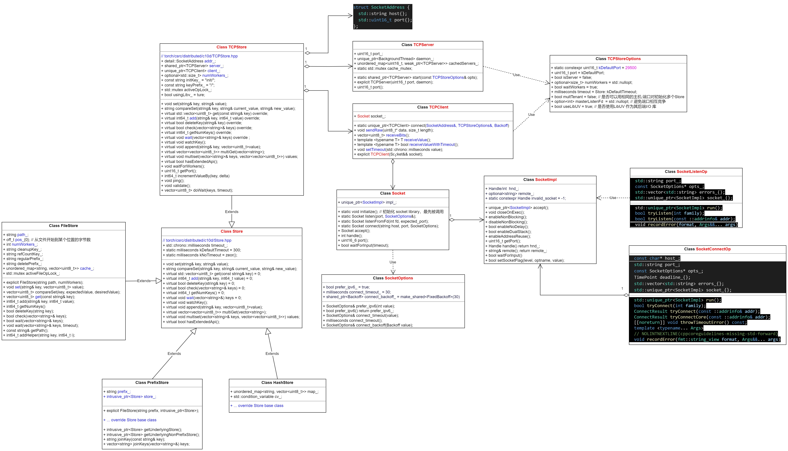
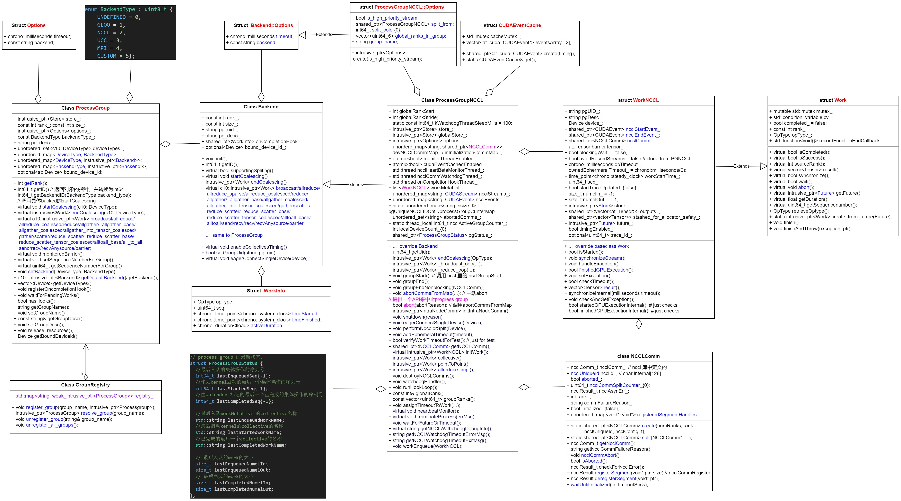
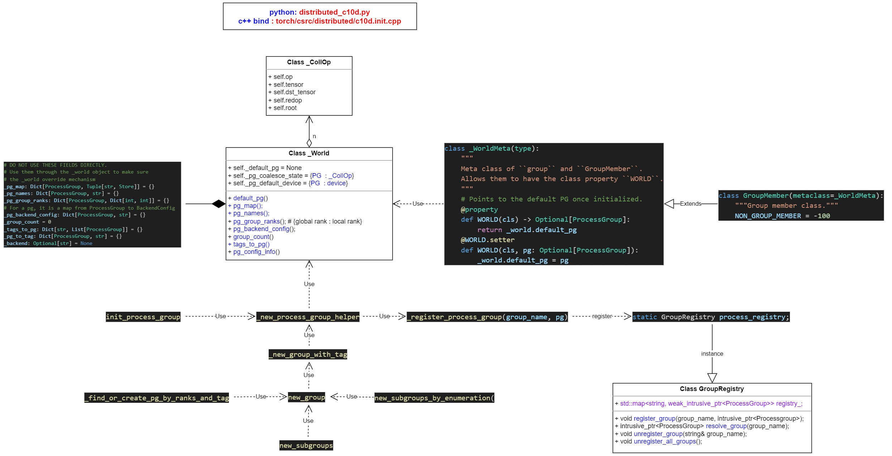

# 1 progress group 相关类 和 通信算子的调用
## 1.1 python 侧通信算子调用接口
- [distributed_c10d.py](https://github.com/pytorch/pytorch/blob/main/torch/distributed/distributed_c10d.py)
```python
# torch/distributed/distributed_c10d.py
def broadcast(tensor, src, group=None, async_op=False):
def all_reduce(tensor, op=ReduceOp.SUM, group=None, async_op=False)
def all_reduce_coalesced(tensors, op=ReduceOp.SUM, group=None, async_op=False)  
def reduce(tensor, dst, op=ReduceOp.SUM, group=None, async_op=False)
def all_gather(tensor_list, tensor, group=None, async_op=False)
def all_gather_coalesced(output_tensor_lists, input_tensor_list, group=None, async_op) 
def gather(tensor, gather_list=None, dst=0, group=None, async_op=False)
def scatter(tensor, scatter_list=None, src=0, group=None, async_op=False)
def reduce_scatter(output, input_list, op=ReduceOp.SUM, group=None, async_op=False)
def all_to_all(output_tensor_list, input_tensor_list, group=None, async_op=False)
def all_to_all_single(output,input, output_split_sizes=None,
                  input_split_sizes=None, group=None, async_op=False)
def barrier(group=GroupMember.WORLD, async_op=False, device_ids=None)
```

## 1.2 统一调度到ProcessGroup中的通信算子
- [ProcessGroup collective method](https://github.com/pytorch/pytorch/blob/main/torch/csrc/distributed/c10d/ProcessGroup.hpp)

**注意：ProcessGroup 统一入口中的通信方法，先调用dispatcher中的collective op, 再用collective op 调用call** <br>

```python
virtual c10::intrusive_ptr<Work> allreduce(
    std::vector<at::Tensor>& tensors,
    const AllreduceOptions& opts = AllreduceOptions()) {

  # 从dispater 中获取collective op 然后再执行
  static auto op =
      c10::Dispatcher::singleton()
          .findSchemaOrThrow("c10d::allreduce_", "")
          .typed<
              std::tuple<std::vector<at::Tensor>, c10::intrusive_ptr<Work>>(
                  at::TensorList,
                  const c10::intrusive_ptr<::c10d::ProcessGroup>&,
                  const c10::intrusive_ptr<::c10d::ReduceOp>&,
                  const std::optional<at::Tensor>& sparse_indices,
                  int64_t)>();

  return std::get<1>(op.call(
      tensors,
      c10::intrusive_ptr<ProcessGroup>::unsafe_reclaim_from_nonowning(this),
      c10::make_intrusive<ReduceOp>(opts.reduceOp),
      opts.sparseIndices,
      opts.timeout.count()));
}
```
**问题时这些通信算子(collective op) 是再哪里被注册的呢？** <br>

## 1.3 collective op func 和 register
- [Ops.cpp](https://github.com/pytorch/pytorch/blob/main/torch/csrc/distributed/c10d/Ops.cpp)

## 1.3.1 通信算子的实现
```python
// Return input tensors as output tensors to make inplace allreduce look like
// a functional API, so that make_fx can correctly build the dependencies in
// the graph later.
#define IMPL_ALLREDUCE(DEV)                                                   \
  std::tuple<std::vector<at::Tensor>, c10::intrusive_ptr<Work>>               \
      allreduce_##DEV(                                                        \
          at::TensorList tensors,                                             \
          const c10::intrusive_ptr<ProcessGroup>& process_group,              \
          const c10::intrusive_ptr<ReduceOp>& reduce_op,                      \
          const std::optional<at::Tensor>& sparse_indices,                    \
          int64_t timeout) {                                                  \
    auto tensor_vec = tensors.vec();                                          \
    auto work = process_group->getBackend(c10::DeviceType::DEV) -> allreduce( \
        tensor_vec,                                                           \
        AllreduceOptions{                                                     \
            *reduce_op.get(), std::chrono::milliseconds(timeout)});           \
    return std::tuple<std::vector<at::Tensor>, c10::intrusive_ptr<Work>>(     \
        std::move(tensor_vec), work);                                         \
  }

IMPL_ALLREDUCE(CPU)
IMPL_ALLREDUCE(CUDA)
IMPL_ALLREDUCE(PrivateUse1)
```

**重点: 可以看出，最终通信算子调度到了具体实现后端(eg. ProcessGroupNCCL)的通信方法里。** <br>

### 1.3.2 通信算子的注册
```python
// 1st level expansion
#define REGISTER_C10D_OP(FUNC)  \
  REGISTER_C10D_OP1(FUNC, CPU)  \
  REGISTER_C10D_OP1(FUNC, CUDA) \
  REGISTER_C10D_OP1(FUNC, PrivateUse1)

// Now we start to register ops with the three device keys

REGISTER_C10D_OP(send)
REGISTER_C10D_OP(recv_)
REGISTER_C10D_OP(recv_any_source_)
REGISTER_C10D_OP(reduce_)
REGISTER_C10D_OP(broadcast_)
REGISTER_C10D_OP(allreduce_)
REGISTER_C10D_OP(allreduce_coalesced_)
REGISTER_C10D_OP(allgather_)
REGISTER_C10D_OP(_allgather_base_)
REGISTER_C10D_OP(allgather_coalesced_)
REGISTER_C10D_OP(allgather_into_tensor_coalesced_)
REGISTER_C10D_OP(reduce_scatter_)
REGISTER_C10D_OP(_reduce_scatter_base_)
REGISTER_C10D_OP(reduce_scatter_tensor_coalesced_)
REGISTER_C10D_OP(gather_)
REGISTER_C10D_OP(scatter_)
REGISTER_C10D_OP(alltoall_)
REGISTER_C10D_OP(alltoall_base_)
REGISTER_C10D_OP(barrier)
```

## 1.4 具体通信后端
- [ProcessGroupNCCL.cpp](https://github.com/pytorch/pytorch/blob/main/torch/csrc/distributed/c10d/ProcessGroupNCCL.cpp)

```python
c10::intrusive_ptr<Work> ProcessGroupNCCL::allreduce(
    std::vector<at::Tensor>& tensors,
    const AllreduceOptions& opts) {
  TORCH_CHECK(tensors.size() == 1, MULTI_DEVICE_ERROR_MSG);
  auto tensor = tensors.back();
  if (tensor.is_complex()) {
    TORCH_CHECK(
        complexViewAsRealAllowed(opts.reduceOp),
        "all_reduce does not support",
        opts.reduceOp,
        "on complex tensors");
    tensor = at::view_as_real(tensor);
  }
  check_gpu_single_tensor(tensor);

  if (intraNodeComm_ != nullptr && opts.reduceOp == ReduceOp::SUM) {
    using namespace intra_node_comm;
    auto algo = intraNodeComm_->selectAllReduceAlgo(tensor);
    if (algo != intra_node_comm::AllReduceAlgo::NONE) {
      intraNodeComm_->allReduce(tensor, algo);
      return c10::make_intrusive<IntraNodeCommWork>();
    }
  }
  TORCH_CHECK(
      !isFloat8Type(tensor.scalar_type()),
      "Float8 dtypes are not currenlty supported for NCCL reductions");
  // @lint-ignore CLANGTIDY
  RECORD_PARAM_COMMS_DATA(
      static_cast<int>(
          this->getSequenceNumberForGroup() + 1), // seq + 1 to match collective
      std::make_tuple(pg_uid_, pg_desc_), // PG name tuple
      tensors, // inputTensors
      tensors, // outputTensors
      rank_, // rank
      "allreduce", // collective name
      tensor.numel(), // inNelems
      tensor.numel(), // outNelems
      tensor.scalar_type(), // dType
      std::vector<int64_t>(), // inSplitSizes
      std::vector<int64_t>(), // outSplitSizes
      globalRankStart, // globalRankStart
      globalRankStride, // globalRankStride
      this->getSize()); // worldSize

  // avoidRecordStreams_ note: collective() will stash tensors.
  return allreduce_impl(tensor, opts);
}
```

## 1.5 collective op kernel
### 1.5.1 cuda kernel
- [https://github.com/pytorch/pytorch/blob/main/torch/csrc/distributed/c10d/intra_node_comm.cu]
```
# /root/mtn/pytorch/torch/csrc/distributed/c10d/intra_node_comm.cu
at::Tensor IntraNodeComm::allReduce(
    const at::Tensor& input,
    AllReduceAlgo algo) {
  // Report usage for testing purposes.
  // We don't care about overflowing.
  ++usageCounter;
  auto stream = at::cuda::getCurrentCUDAStream();
  c10::cuda::CUDACachingAllocator::recordStream(
      input.storage().data_ptr(), stream);
  switch (algo) {
    case AllReduceAlgo::ONE_SHOT:
      return oneShotAllReduce(input, stream);
    case AllReduceAlgo::TWO_SHOT:
      return twoShotAllReduce(input, stream);
    case AllReduceAlgo::HCM:
      return hybridCubeMeshAllReduce(input, stream);
    default:
      C10_THROW_ERROR(ValueError, "IntraNodeComm: invalid algo");
  }
}
```

### 1.5.2 调用NCCL 通信库
- [ProcessGroupNCCL.cpp](https://github1s.com/pytorch/pytorch/blob/main/torch/csrc/distributed/c10d/ProcessGroupNCCL.cpp)
  
```python
# torch/csrc/distributed/c10d/ProcessGroupNCCL.cpp
c10::intrusive_ptr<Work> ProcessGroupNCCL::allreduce_impl(
    at::Tensor& tensor,
    const AllreduceOptions& opts) {
  return collective(
      tensor,
      tensor,
      [&](at::Tensor& input,
          at::Tensor& output,
          ncclComm_t comm,
          at::cuda::CUDAStream& stream) {
        auto ncclDataType = getNcclDataType(input.scalar_type());
        auto ncclReduceOp =
            getNcclReduceOp(opts.reduceOp, input, ncclDataType, comm);
        return ncclAllReduce(
            input.data_ptr(),
            output.data_ptr(),
            input.numel(),
            ncclDataType,
            ncclReduceOp,
            comm,
            stream.stream());
      },
      OpType::ALLREDUCE,
      "nccl:all_reduce");
}
```

# 2 Work 作用
- [Work 类](torch/csrc/distributed/c10d/Work.hpp)

&nbsp;&nbsp;&nbsp;&nbsp;&nbsp;&nbsp;&nbsp;&nbsp;在 PyTorch 的 csrc/distributed/c10d/Work.hpp 文件中，Work 类是与分布式训练中的异步操作和任务管理相关的核心组件。Work 类的主要作用是封装和管理分布式训练中的异步工作单元，这些工作单元可能涉及跨多个计算节点的数据传输、梯度同步或其他通信操作。<br>

&nbsp;&nbsp;&nbsp;&nbsp;&nbsp;&nbsp;&nbsp;&nbsp;以下是 Work 类在 PyTorch 分布式训练中的一些关键作用：<br>

- 异步操作封装：<br>
&nbsp;&nbsp;&nbsp;&nbsp;&nbsp;&nbsp;&nbsp;&nbsp;Work 类用于封装分布式训练中的异步操作。这些操作可能涉及网络通信、数据同步或模型参数的更新等。通过 Work 类，开发者可以提交异步任务并在任务完成时获取结果，而无需阻塞主线程。<br>

- 任务管理与调度：<br>
&nbsp;&nbsp;&nbsp;&nbsp;&nbsp;&nbsp;&nbsp;&nbsp;Work 类提供了任务管理和调度的功能。它允许开发者跟踪异步任务的执行状态，包括任务是否已启动、是否已完成以及是否遇到错误。这有助于开发者在分布式训练中更有效地管理资源和任务，确保训练过程的顺利进行。<br>

- 错误处理与恢复：<br>
&nbsp;&nbsp;&nbsp;&nbsp;&nbsp;&nbsp;&nbsp;&nbsp;ork 类还提供了错误处理和恢复机制。当异步任务遇到错误时，Work 类可以捕获这些错误并向开发者报告。开发者可以根据错误信息采取相应的恢复措施，以确保训练的连续性和稳定性。<br>

- 性能优化：<br>
&nbsp;&nbsp;&nbsp;&nbsp;&nbsp;&nbsp;&nbsp;&nbsp;通过 Work 类，开发者可以优化分布式训练的性能。例如，他们可以利用 Work 类提供的接口来重叠计算和通信操作，从而减少训练过程中的等待时间。此外，Work 类还可以与 PyTorch 中的其他性能优化技术（如梯度压缩、混合精度训练等）结合使用，以进一步提高训练效率。<br>

- 跨节点通信：<br>
&nbsp;&nbsp;&nbsp;&nbsp;&nbsp;&nbsp;&nbsp;&nbsp;Work 类在跨节点通信中发挥着关键作用。它允许不同计算节点上的进程相互通信和同步数据，这是分布式训练中的核心功能之一。通过 Work 类，开发者可以实现高效的跨节点通信，从而加速训练过程并提高模型的收敛速度。需要注意的是，Work 类的具体实现和使用方式可能因 PyTorch 的版本和分布式训练的后端（如 NCCL、Gloo 或 MPI）而有所不同。因此，开发者在使用 Work 类时需要参考 PyTorch 的官方文档和分布式训练的相关指南，以确保正确理解和使用这一功能。<br>

总的来说，Work 类在 PyTorch 分布式训练中扮演着重要角色，它封装和管理异步操作，提供任务管理和调度功能，支持错误处理和恢复机制，并有助于优化训练性能和实现跨节点通信。<br>

# 3 Future
- [Future 类](pytorch/aten/src/ATen/core/ivalue_inl.h)

&nbsp;&nbsp;&nbsp;&nbsp;&nbsp;&nbsp;&nbsp;&nbsp;在 /home/mtn_torch/pytorch/aten/src/ATen/core/ivalue_inl.h 文件中，Future 是一个重要的类，它主要用于表示**异步计算**的结果。这个 Future 类是 IValue 类的一个扩展或特化，用于**封装异步操作完成后的返回值**。以下是 Future 在这个上下文中的主要作用：

- 封装异步结果：<br>
Future 对象用于存储异步操作完成后的结果。这允许程序在异步操作进行时继续执行其他任务，而无需等待结果。一旦异步操作完成，Future 对象将持有该操作的结果，并允许调用者通过适当的接口检索这个结果。<br>

- 提供非阻塞接口：<br>
通过 Future，调用者可以查询异步操作的状态（例如，是否已完成、是否出错）以及获取操作的结果。调用者可以选择阻塞等待结果（如果结果尚未可用），或者继续执行其他任务并在稍后检查 Future 的状态。<br>

- 支持链式操作和回调：<br>
Future 通常支持链式操作，允许调用者将多个异步操作链接在一起，形成一个执行链。此外，Future 还可能支持回调机制，允许调用者注册在异步操作完成时执行的回调函数。<br>

- 错误处理：<br>
Future 提供了错误处理机制，允许调用者在尝试获取结果时捕获和处理可能发生的异常。这使得异步编程更加健壮，因为调用者可以优雅地处理错误情况，而不是让程序崩溃。<br>

- 跨线程和跨进程通信：<br>
在多线程或分布式环境中，Future 可以作为线程间或进程间通信的一种机制。一个线程或进程可以执行异步操作并返回一个 Future 对象给另一个线程或进程，后者可以在适当的时候查询或等待这个 Future 对象的结果。<br>

&nbsp;&nbsp;&nbsp;&nbsp;&nbsp;&nbsp;&nbsp;&nbsp;在 PyTorch 的实际应用中，Future 通常与异步执行的任务一起使用，如网络请求、数据库查询、大规模数据处理或复杂的计算任务（如神经网络的前向传播和反向传播）。通过 Future，开发者可以构建出具有高性能和良好用户体验的应用程序，因为程序可以在等待异步操作完成时继续执行其他任务。<br>

&nbsp;&nbsp;&nbsp;&nbsp;&nbsp;&nbsp;&nbsp;&nbsp;需要注意的是，Future 的具体实现和使用方式可能因 PyTorch 的版本和构建配置而有所不同。因此，开发者在使用 Future 时需要参考 PyTorch 的官方文档和源代码，以确保正确理解和使用这个类。<br>

# 4 Store
## 4.1 TCPStore
&nbsp;&nbsp;&nbsp;&nbsp;&nbsp;&nbsp;&nbsp;&nbsp;在PyTorch分布式系统中，TCPStore主要用于**进程间的通信和初始化分布式进程组**。TCPStore作为分布式键值存储(KVStore)，允许进程之间共享信息，这在分布式训练中非常重要。<br>

&nbsp;&nbsp;&nbsp;&nbsp;&nbsp;&nbsp;&nbsp;&nbsp;具体来说，在PyTorch分布式训练中，TCPStore可能用于设置和存储以下类型的数据：<br>
- 进程初始化信息：<br>
&nbsp;&nbsp;&nbsp;&nbsp;&nbsp;&nbsp;&nbsp;&nbsp;在分布式训练中，每个进程需要知道如何联系其他进程。TCPStore可以存储这些信息，如主进程的IP地址（MASTER_ADDR）和端口号（MASTER_PORT），以及参与训练的进程总数（world_size）和当前进程的等级（rank）。这些信息是初始化分布式进程组所必需的。<br>

- 模型参数和梯度：<br>
&nbsp;&nbsp;&nbsp;&nbsp;&nbsp;&nbsp;&nbsp;&nbsp;虽然TCPStore不是直接用于存储模型参数和梯度的（这些通常存储在GPU或其他设备的内存中），但在某些情况下，TCPStore可能用于在进程之间传递参数或梯度的更新信息。然而，在PyTorch的分布式数据并行（DDP）中，梯度的同步通常是通过更高效的通信机制（如AllReduce）来实现的。<br>

- 训练状态信息：<br>
&nbsp;&nbsp;&nbsp;&nbsp;&nbsp;&nbsp;&nbsp;&nbsp;TCPStore还可以用于存储训练过程中的状态信息，如当前迭代次数、学习率等。这些信息可以在进程之间共享，以确保所有进程都使用相同的训练设置。<br>

- 同步信号：<br>
&nbsp;&nbsp;&nbsp;&nbsp;&nbsp;&nbsp;&nbsp;&nbsp;在分布式训练中，进程之间需要同步以确保它们按照相同的步骤进行训练。TCPStore可以用于存储同步信号，以指示所有进程都已准备好进入下一个训练阶段。<br>

- 其他辅助信息：<br>
&nbsp;&nbsp;&nbsp;&nbsp;&nbsp;&nbsp;&nbsp;&nbsp;根据具体的应用场景，TCPStore还可以存储其他类型的辅助信息，如日志信息、调试信息等。这些信息有助于监控和调试分布式训练过程。<br>
&nbsp;&nbsp;&nbsp;&nbsp;&nbsp;&nbsp;&nbsp;&nbsp;需要注意的是，TCPStore只是PyTorch分布式系统中的一个组件，它与其他组件（如后端通信机制、进程组等）一起工作，以实现高效的分布式训练。在使用TCPStore时，需要确保所有进程都能够访问它，并且需要仔细处理竞争条件和同步问题。<br>

&nbsp;&nbsp;&nbsp;&nbsp;&nbsp;&nbsp;&nbsp;&nbsp;此外，PyTorch还提供了其他初始化方法（如环境变量初始化、共享文件系统初始化等），这些方法可以根据具体的应用场景和需求来选择。在选择初始化方法时，需要考虑系统的可用性、可靠性和性能等因素。<br>

## 4.2 FileStore
- 作用：FileStore是一个基于文件系统的分布式存储实现，它使用文件来存储键值对。它允许在多个进程之间共享数据，而无需通过网络进行传输。<br>
- 特点：FileStore的优点是简单且易于实现，因为它依赖于现有的文件系统。然而，它的性能可能受到文件系统I/O性能的限制。它适用于对性能要求不高的分布式应用场景。<br>
- 用法：在使用FileStore时，需要指定一个文件路径来存储键值对。多个进程可以访问同一个文件路径来共享数据。<br>

## 4.3 Store UML



# 5 c++ process group



# 6 create process group 




