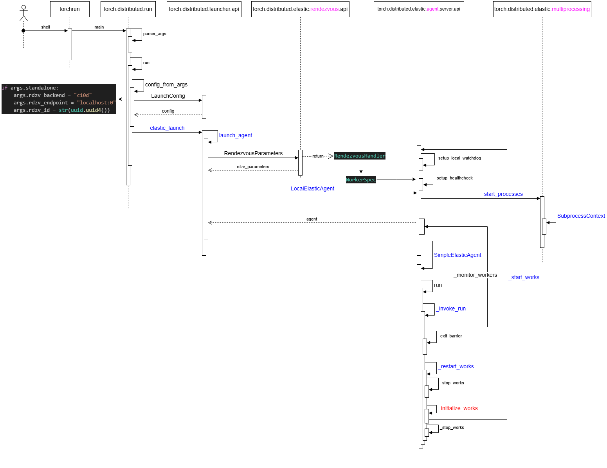

# 0 torchrun
- /root/miniconda3/envs/pytorch2.5/bin/torchrun

```python
#!/root/miniconda3/envs/pytorch2.5/bin/python
# -*- coding: utf-8 -*-
import re
import sys
from torch.distributed.run import main
if __name__ == '__main__':
    # sys.argv = ['/root/miniconda3/envs/pytorch2.5/bin/torchrun', '--nproc_per_node=2', '--rdzv_backend', 'c10d', '--rdzv_endpoint=localhost:0', '--local-ranks-filter', '0', '--role', 'rank', '--tee', '3', 'train.py', '--job.config_file', './train_configs/llama2_7b.toml']
    sys.argv[0] = re.sub(r'(-script\.pyw|\.exe)?$', '', sys.argv[0])
    sys.exit(main())
```

# 1 torch.distributed.run
- torchrun 多进程启动流程如下：<br>


# 2 torchrun 指令
## 2.1 启动参数
- -h, --help：<br>
  显示帮助消息并退出.<br>
- --nnodes NNODES：<br>
  节点数，或节点范围的格式<minimum_nodes>:<maximum_nodes>;<br>
- --nproc_per_node/--nproc-per-node NPROC_PER_NODE：<br>
  每个节点的工作进程数；支持的值：[auto, cpu, gpu, int];<br>
- --rdzv_backend/rdzv-backend RDZV_BACKEND：<br>
  集合（Rendezvous）后端;<br>
- --rdzv_endpoint/rdzv-endpoint RDZV_ENDPOINT：<br>
  集合后端端点；通常格式为<host>:<port>;<br>
- --rdzv_id/rdzv-id RDZV_ID：<br>
  用户定义的group id;<br>
- --rdzv-conf/rdzv_conf RDZV_CONF：<br>
  额外的集合配置（<key1>=<value1>,<key2>=<value2>,...）;<br>
- --standalone：<br>
  启动一个**本地独立的集合后端**，该后端由一个空闲端口上的C10d TCP存储表示。这对于启动单节点多工作进程作业很有用。如果指定了该选项，则会**自动分配--rdzv-backend、--rdzv-endpoint和--rdzv-id，并忽略任何显式设置的值**;<br>
- --max_restarts/max-restarts MAX_RESTARTS：<br>
  在失败之前工作进程组的**最大重启次数**;<br>
- --monitor_interval/monitor-interval MONITOR_INTERVAL：<br>
  监控工作进程状态的间隔（秒）;<br>
- --start_method/start-method {spawn,fork,forkserver}：<br>
  创建工作进程时使用的多进程启动方法;<br>
- --role ROLE：<br>
  用户定义的工作进程workers角色;<br>
- -m, --module：<br>
  将每个进程更改为将启动脚本解释为Python模块，以与python -m相同的行为执行;<br>
- --no_python/no-python：<br>
  不在训练脚本前添加python——直接执行它。当脚本不是Python脚本时很有用;<br>
- --run_path/run-path：<br>
  使用runpy.run_path在同一解释器中运行训练脚本。脚本必须提供为绝对路径(例如/abs/path/script.py),这优先于--no-python;<br>
- --log_dir/log-dir LOG_DIR：<br>
  用于日志文件的基础目录（例如/var/log/torch/elastic）。对于多次运行，将重复使用相同的目录(使用**rdzv_id作为前缀**创建一个唯一的作业级子目录);<br>
- -r REDIRECTS, --redirects REDIRECTS：<br>
  将标准流重定向到日志目录中的日志文件（例如[-r 3]将所有工作进程的stdout+stderr重定向，[-r 0:1,1:2]将本地等级0的stdout和等级1的stderr重定向）;<br>
- -t TEE, --tee TEE：<br>
  将标准流复制到 **日志文件(a log file)** 并输出到控制台(请参阅--redirects以了解格式);<br>
- --local_ranks_filter/local-ranks-filter LOCAL_RANKS_FILTER：<br>
  仅在控制台中显示指定等级的日志（例如[--local_ranks_filter=0,1,2]将仅显示等级0、1和2的日志）。这仅适用于stdout和stderr，不适用于通过--redirect或--tee保存的日志文件;<br>
- --node_rank/node-rank NODE_RANK：<br>
  多节点分布式训练中的node rank;<br>
- --master_addr/master-addr MASTER_ADDR：<br>
  主节点（rank0）的地址，仅用于static rendezvous。它可以是rank0的**IP地址或主机名**, 对于单节点多进程训练，--master-addr可以简单地是127.0.0.1；IPv6应该有模式[0:0:0:0:0:0:0:1];<br>
- --master_port/ master-port MASTER_PORT：<br>
  主节点（rank0）上用于分布式训练期间通信的端口。它仅用于static rendezvous;<br>
- --local_addr/local-addr LOCAL_ADDR：<br>
  本地节点的地址。**如果指定，将使用给定的地址进行连接。否则，将查找本地节点地址。** 否则，它将默认为本地机器的FQDN(完全限定域名);<br>
- --logs_specs/logs-specs LOGS_SPECS：<br>
  torchrun.logs_specs组入口点名称，值必须是LogsSpecs类型。可用于覆盖自定义日志行为。-h, --help：显示帮助消息并退出。<br>

## 2.2 参数解释
- Node - 物理实例或容器；映射到与 job manager 所协调的单元。<br>
- Worker - 分布式训练环境中的worker。<br>
- WorkerGroup - 执行相同功能的一组worker（例如trainers）。<br>
- LocalWorkerGroup - 在同一节点上运行的工作组中的workers子集。<br>
  一个节点运行 LOCAL_WORLD_SIZE个workers，这些 workers 组成LocalWorkerGroup。<br>
  节点上所有LocalWorkerGroups组成WorkerGroups。<br>
- RANK - 工作组中worker的rank，是全局rank，可以认为是一个全局GPU资源列表。<br>
  **Rank是不稳定的，在重启之间，本地Workers 会被分配到不同的ranks，所以不要在代码中对RANK 和LOCAL_RANK的稳定性做任何假设和依赖编码。** <br>
  **rendezvous完成后，其所有成员将对工作成员资格以及每个人在其中的角色（role）达成共识。此角色（role）使用一个介于 0 ~ world size 之间的整型来表示，被称之为rank。** <br>
- LOCAL_RANK - 本地工作组中，某个worker 的 rank，可以认为是当前节点上的GPU资源列表。<br>
- GROUP_RANK - worker group的rank。介于0和“最大节点数”之间的数字。如果每个节点运行一个单一工作组，那GROUP_RANK就是这个节点的rank。<br>
- ROLE_RANK - 对于具有相同角色worker来说，他们之间共享的rank，角色在“WorkerSpec”中被指定。<br>
- WORLD_SIZE - 工作组中worker的总数。因为节点会加入/离开，所以WORLD_SIZE会变化，不能依赖 WORLD_SIZE的稳定性进行编码。<br>
- LOCAL_WORLD_SIZE - 本地工作组的大小，即本地运行的worker数目，等于在torch.distributed.run运行时候指定的--nproc_per_node。目前，torch/distributed/run.py 仅支持同构的 LOCAL_WORLD_SIZE。也就是说，假设所有节点运行相同数量的本地工作者（每个角色）。<br>
- ROLE_WORLD_SIZE - 具有同样角色的workers总数，在 WorkerSpec之中被指定。<br>
- rdzv_id - 用户定义的id，用于唯一标识作业的工作组。这个id在每个节点加入特定工作组时候使用。<br>
- rdzv_backend-rendezvous 的后端（例如“c10d”）。这通常是一个强一致性的键值存储。<br>
- rdzv_endpoint - rendezvous 后端端点；通常以“<host>：<port>”的形式出现。<br>
- run_id： 用户定义的id，它唯一地标识分布式应用程序的一个实例。它通常映射到作业id并用于允许节点加入正确的分布式应用程序。<br>
- TORCHELASTIC_RUN_ID - 与 rendezvous run_id 相等，即唯一的job id。<br>
- TORCHELASTIC_RESTART_COUNT - 迄今为止，工作组重启的次数。<br>
- TORCHELASTIC_MAX_RESTARTS - 配置的最大重启数目。<br>

# 3 Pytorch Elastic Trainer (PET)
&nbsp;&nbsp;&nbsp;&nbsp;&nbsp;&nbsp;&nbsp;&nbsp;PyTorch Elastic Trainer (PET) 提供了一个可以用**容错**和**弹性**方式跨集群来训练模型的框架。PET 通过两种方式提供这些功能：<br>
- 容错: 当 PyTorch worker 进程抛出某类可重试错误时，它会被 PET 捕获并**重试训练过程**。<br>
- 弹性：只要worker的数量维持在开始工作时指定的范围内，新worker就可以随时离开或加入到现有训练job的进程池。当成员发生变化时，所有worker会**重新集合（re-rendezvous）** 以**建立一个新的进程组**，并从以前的良好状态之中恢复训练。<br>

&nbsp;&nbsp;&nbsp;&nbsp;&nbsp;&nbsp;&nbsp;&nbsp;为了与 PET 集成，PyTorch 用户需要对其训练逻辑进行以下更改：<br>
- 用户需要使 PET 来控制他们的训练循环。<br>
&nbsp;&nbsp;&nbsp;&nbsp;&nbsp;&nbsp;&nbsp;&nbsp;本质上，用户提供了一个“内部训练”循环，该循环被 PET 包裹在一个可重试的循环中。<br>
&nbsp;&nbsp;&nbsp;&nbsp;&nbsp;&nbsp;&nbsp;&nbsp;PET循环是可重试的循环，其负责**建立或重新建立过程组**，以及将用户的训练恢复到良好状态。<br>
- 在新worker加入进程池时，用户需要指定**状态是什么(weight, optimizer state ...)** 以及如何把状态施加到一个新worker之上。<br>

# 4 架构概述
## 4.1 Agent
&nbsp;&nbsp;&nbsp;&nbsp;&nbsp;&nbsp;&nbsp;&nbsp;每个节点有一个独立的elastic-agent(LocalElasticAgent)。每个代理进程只负责管理该节点的一组本地工作进程，并与本作业(job)其他节点上的弹性代理(elastic)一起协调来确定进程组(ProcessGroup)成员身份的变化。具体如下图所示：<br>

&nbsp;&nbsp;&nbsp;&nbsp;&nbsp;&nbsp;&nbsp;&nbsp;Agent是运行在单节点上的独立后台进程，可以认为是 worker manager 或者 process supervisor，其**负责启动worker，监控 worker 运行，捕获woker异常**，通过 **rendezvous 实现 worker 间的相互发现**（比如把状态上报到KVStore），成员变动时候**基于 rendezvous 进行变更同步**等等。<br>

&nbsp;&nbsp;&nbsp;&nbsp;&nbsp;&nbsp;&nbsp;&nbsp;**Rendezvous:** 为了实现弹性训练，需要有一个节点/进程之间彼此发现的机制。Rendezvous就是这个发现机制或者说同步组件。当系统启动或者成员变更时候，所有worker会（重新）集合（rendezvous）以建立一个新的进程组。<br>


## 4.2 特点
- 容错：通过重新启动所有workers，可以优雅地处理worker故障。<br>
- 自动：Worker 的RANK 和 WORLD_SIZE 是自动分配的, 不许手动分配了。<br>
- 弹性：允许在最小值和最大值（弹性）之间更改节点数。<br>

## 4.3 用户改动
- 无需手动传递RANK , WORLD_SIZE , MASTER_ADDR 和 MASTER_PORT。<br>
- 必须提供rdzv_backend : 对于大多数用户来说，这其实就是“c10d”（参见“rendezvous“）<br>
- 必须提供 rdzv_endpoint : 其实这就**替代了之前的MASTER_ADDR 和 MASTER_PORT**. <br>
- **use_env参数**已被删除。请从 LOCAL_RANK 环境变量中获取local_rank （例如，os.environ["LOCAL_RANK"]）. <br>
- 用户需要确保脚本中有 load_checkpoint(path) 和 save_checkpoint(path) 逻辑，即手动处理Checkpoint。因为**当worker失败时，我们将使用最近的checkpoint来恢复现场，重启所有worker**。<br>

## 4.4 成员变更
&nbsp;&nbsp;&nbsp;&nbsp;&nbsp;&nbsp;&nbsp;&nbsp;当一个工作进程失败时，管理它的弹性代理(elastic-agent)会杀死该节点上的所有worker，然后与其他代理建立一个集合操作（rendezvous），并使用新的集合信息来**重启worker**。<br>
&nbsp;&nbsp;&nbsp;&nbsp;&nbsp;&nbsp;&nbsp;&nbsp;但是，当代理以非零错误代码退出时(错误或异常, 0 是正常退出)，应该由**上层调度模块（例如 Kubernetes）来重新启动代理**（同理，此代理将重新启动它负责的所有worker）。相同的恢复机制也适用于节点级故障。编排工具（诸如 Kubernetes ）会调度作业以便job可以使用最小数目的代理副本运行，然后每个代理将依次编排用户的训练脚本。<br>


## 4.5 变更流程


# 5 问题及解决思路
- 需要一个节点/进程之间彼此发现的机制<br>
&nbsp;&nbsp;&nbsp;&nbsp;&nbsp;&nbsp;&nbsp;&nbsp;当成员发生变化时，所有worker会重新集合（re-rendezvous）以建立一个新的进程组。rendezvous就是这个发现机制。
&nbsp;&nbsp;&nbsp;&nbsp;&nbsp;&nbsp;&nbsp;&nbsp;如果有一个worker出现了问题，则该node上的agent会重启本node的所有worker进行**新一轮rendezvous**，因为是新一轮rendezvous，所以**其他节点也会重启其worker**，然后大家一起继续训练<br>
- 如何处理成员变更<br>
&nbsp;&nbsp;&nbsp;&nbsp;&nbsp;&nbsp;&nbsp;&nbsp;当一个工作进程失败时，管理它的弹性代理会杀死该节点上的所有worker，然后与其他代理建立一个集合操作（rendezvous），并使用新的集合信息来重启worker。但是，当代理以非零错误代码退出时，应该由上层调度模块（例如 Kubernetes）来重新启动代理（同理，此代理将重新启动它负责的所有worker）。<br>
- 如何捕获单个进程训练失败，如何在单个节点上管理所有训练进程<br>
&nbsp;&nbsp;&nbsp;&nbsp;&nbsp;&nbsp;&nbsp;&nbsp;每个代理进程只负责管理该节点的一组本地工作进程，并与本作业其他节点上的弹性代理一起协调来**确定进程组成员身份的变化**。<br>
- 如何与现有训练代码集成。<br>
&nbsp;&nbsp;&nbsp;&nbsp;&nbsp;&nbsp;&nbsp;&nbsp;应用程序只需让其入口点或main函数与PyTorch distributed launcher兼容 。<br>
- 如何监控
&nbsp;&nbsp;&nbsp;&nbsp;&nbsp;&nbsp;&nbsp;&nbsp;TE定义了一个monitor方法，定时调用来监控本地进程异常，转换为内部状态数值，进行处理。<br>

# 6 代码分析
## 6.1 world_size，rank
&nbsp;&nbsp;&nbsp;&nbsp;&nbsp;&nbsp;&nbsp;&nbsp;这两个变量是动态生成的，所以从 state 之中取出。<br>

```python
rank, world_size = self._get_world()
    
def _get_world(self) -> Tuple[int, int]:
	state = self._state_holder.state
	return state.participants[self._this_node], len(state.participants)
```

## 6.2 _pg_group_ranks
&nbsp;&nbsp;&nbsp;&nbsp;&nbsp;&nbsp;&nbsp;&nbsp;该全局变量存储了每个 group 的 global rank 到 local rank 映射信息。<br>

```python
# Process group's global rank to local rank mapping
_pg_group_ranks: Dict[ProcessGroup, Dict[int : global rank, int : local rank]] = {}
```

其赋值举例如下：

```python
# Create the global rank to group rank mapping
_pg_group_ranks[pg] = {
    global_rank: group_rank
    # ranks 里存储的是 global rank, enumerate 产生的 0,1,2,3... 是 local_rank/group_rank
    for group_rank, global_rank in enumerate(ranks)
}
```


## 6.3 group_rank : local rank
&nbsp;&nbsp;&nbsp;&nbsp;&nbsp;&nbsp;&nbsp;&nbsp;可以利用 global rank 从 _pg_group_ranks 之中提取对应的 local rank。<br>

```python
def _get_group_rank(group: ProcessGroup, rank):
    """
    Helper that gets a given group's local rank in the group from a given global
    rank.
    """
    if group is GroupMember.WORLD:
        raise RuntimeError("group.WORLD does not have local rank to global "
                           "rank mapping")
    if group not in _pg_group_ranks:
        raise RuntimeError("The given group does not exist")
    try:
        group_rank = _pg_group_ranks[group][rank]
    except KeyError:
        raise RuntimeError(f"The global rank {rank} is not part of the group {group}") from None
    return group_rank
```

## 6.4 global_rank
&nbsp;&nbsp;&nbsp;&nbsp;&nbsp;&nbsp;&nbsp;&nbsp;我们可以利用一个 group 的 local rank 获取到其 gloabl rank。<br>

```python
def _get_global_rank(group, group_rank):
    """
    Helper that gets a given group's global rank from a given local rank in the
    group.
    """
    if group is GroupMember.WORLD:
        raise RuntimeError("group.WORLD does not have local rank to global "
                           "rank mapping")
    group_rank_map = _pg_group_ranks[group]
    for rank, grp_rank in group_rank_map.items():
        if grp_rank == group_rank:
            return rank
    raise RuntimeError("The group rank is not part of the group")
```

## 6.5 group_size
&nbsp;&nbsp;&nbsp;&nbsp;&nbsp;&nbsp;&nbsp;&nbsp;我们可以 _get_group_size 获取到某一个group 的大小。<br>
```python
def _get_group_size(group):
    """
    Helper that gets a given group's world size.
    """
    if group is GroupMember.WORLD or group is None:
        default_pg = _get_default_group()
        return default_pg.size()
    if group not in _pg_group_ranks:
        raise RuntimeError("The given group does not exist")
    return len(_pg_group_ranks[group])
```

## 6.6 nproc_per_node --> local_world_size
&nbsp;&nbsp;&nbsp;&nbsp;&nbsp;&nbsp;&nbsp;&nbsp;这个变量可以得到每个node之上支持多少个进程.<br>

```python
def determine_local_world_size(nproc_per_node: str):
    try:
        logging.info(f"Using nproc_per_node={nproc_per_node}.")
        return int(nproc_per_node)
    except ValueError:
        if nproc_per_node == "cpu":
            num_proc = os.cpu_count()
            device_type = "cpu"
        elif nproc_per_node == "gpu":
            if not torch.cuda.is_available():
                raise ValueError("Cuda is not available.")
            device_type = "gpu"
            num_proc = torch.cuda.device_count()
        elif nproc_per_node == "auto":
            if torch.cuda.is_available():
                num_proc = torch.cuda.device_count()
                device_type = "gpu"
            else:
                num_proc = os.cpu_count()
                device_type = "cpu"
        else:
            raise ValueError(f"Unsupported nproc_per_node value: {nproc_per_node}")
        )
        return num_proc
```

# 7 正在实现流程


## 7.1 elastic_launch 入口
&nbsp;&nbsp;&nbsp;&nbsp;&nbsp;&nbsp;&nbsp;&nbsp;通过torchrun 可以调用elastic_launch, 也可以直接用torch.distributed.launcher.api.elastic_launch 来直接调用elastic_launch. <br>
```python
import uuid
import torch
from torch.distributed.launcher.api import LaunchConfig, elastic_launch

def worker_fn(t1, t2):
    return torch.add(t1, t2)

def main():
    t1 = torch.rand((3,3), requires_grad=True)
    t2 = torch.rand((3, 3), requires_grad=True)

    config = LaunchConfig(
        min_nodes=2,
        max_nodes=4,
        nproc_per_node=1,
        run_id=str(uuid.uuid4()),
        role="trainer",
        rdzv_endpoint="localhost:29400",
        rdzv_backend="c10d",
        max_restarts=1,
        monitor_interval=1,
        start_method="spawn",
    )

    outputs = elastic_launch(config, worker_fn)(t1, t2)

if __name__ == '__main__':
    main()

```
## 7.2 elastic_launch 中 launch_agent
```python
class elastic_launch:
    """
    Launches an torchelastic agent on the container that invoked the entrypoint.

        1. Pass the ``entrypoint`` arguments as non ``kwargs`` (e.g. no named parameters)/
           ``entrypoint`` can be a function or a command.
        2. The return value is a map of each worker's output mapped
           by their respective global rank.
    """

    def __init__(
        self,
        config: LaunchConfig,
        entrypoint: Union[Callable, str, None],
    ):
        self._config = config
        self._entrypoint = entrypoint

    def __call__(self, *args, **kwargs):
        return launch_agent(self._config, self._entrypoint, list(args)) # 内部会调用用户程序
```

## 7.3 启动代理
launch_agent 启动了一个LocalElasticAent, 调用其run 方法：<br>
```python
@record
def launch_agent(
    config: LaunchConfig,
    entrypoint: Union[Callable, str, None],
    args: List[Any],
) -> Dict[int, Any]:
    if not config.run_id:
        run_id = str(uuid.uuid4().int)
        config.run_id = run_id

    entrypoint_name = _get_entrypoint_name(entrypoint, args)

    rdzv_parameters = RendezvousParameters(
        backend=config.rdzv_backend,
        endpoint=config.rdzv_endpoint,
        run_id=config.run_id,
        min_nodes=config.min_nodes,
        max_nodes=config.max_nodes,
        **config.rdzv_configs,
    )

    agent = None
    rdzv_handler = rdzv_registry.get_rendezvous_handler(rdzv_parameters)
    master_addr, master_port = _get_addr_and_port(rdzv_parameters)
    try:
        spec = WorkerSpec( # 1. 得到spec
            role=config.role,
            local_world_size=config.nproc_per_node,
            entrypoint=entrypoint,
            args=tuple(args),
            rdzv_handler=rdzv_handler, # RendezvousHandler
            max_restarts=config.max_restarts,
            monitor_interval=config.monitor_interval,
            redirects=config.redirects,
            tee=config.tee,
            master_addr=master_addr,
            master_port=master_port,
        )

        cfg = metrics.MetricsConfig(config.metrics_cfg) if config.metrics_cfg else None
        metrics.initialize_metrics(cfg)

        agent = LocalElasticAgent( # 2. 构建代理
            spec=spec, start_method=config.start_method, log_dir=config.log_dir
        )

        result = agent.run() # 3. 启动代理
        events.record(agent.get_agent_status_event(WorkerState.SUCCEEDED))
        if result.is_failed():
            # ChildFailedError is treated specially by @record
            # if the error files for the failed children exist
            # @record will copy the first error (root cause)
            # to the error file of the launcher process.
            raise ChildFailedError(
                name=entrypoint_name,
                failures=result.failures,
            )
        else:
            return result.return_values
    except ChildFailedError:
        raise
    except Exception:
        if agent:
            events.record(agent.get_agent_status_event(WorkerState.FAILED))
        else:
            events.record(_construct_event(config))
        raise
    finally:
        rdzv_handler.shutdown()
```

### 7.3.1 WorkSpec
WorkerSpec ：这是配置信息，里面包含了代理所需要的某些全局信息，比如 RendezvousHandler，role，entry（用户函数）。<br>
```python
spec = {WorkerSpec} 
   args = {tuple: 2} (tensor, tensor)
   fn = {NoneType} None
   local_world_size = {int} 1
   master_addr = {NoneType} None
   master_port = {NoneType} None
   max_restarts = {int} 1
   monitor_interval = {int} 1
   rdzv_handler = {DynamicRendezvousHandler}
   redirects = {Std} Std.NONE
   role = {str} 'trainer'
   tee = {Std} Std.NONE
   entry = worker_fn
```

Agent会从这里提取各种所需信息。比如_start_workers 会从中获取 store。<br>

```python
use_agent_store = spec.rdzv_handler.get_backend() == "static"
```

详细逻辑为：<br>

```python
+--------------------------+      +---------------------------------------------------+
|LocalElasticAgent         |      | WorkerSpec                                        |
|                          |      |                                                   |
|     WorkerSpec +--------------> |      rdzv_handler = {DynamicRendezvousHandler} --------+
|                          |      |                                                   |    |
|     rdzv_run_id          |      |      entry = worker_fn                            |    |
|                          |      |                                                   |    |
|     store                |      |      role = {str} 'trainer'                       |    |
|                          |      |                                                   |    |
|                          |      +---------------------------------------------------+    |
|                          |                                                               |
|                          |                                                               |
|                          |                                                               |
|                          |                                                               |
|                          |               +-----------------------------------------+     |
+--------------------------+               |DynamicRendezvousHandler                 |     |
                                           |                                         |     |
                                           |                                         |     |
                                           |   _settings: RendezvousSettings         | <---+
                                           |                                         |
                                           |   _store: Store                         |
                                           |                                         |
                                           |   _state_holder: _RendezvousStateHolder |
                                           |                                         |
                                           |   _op_executor: _RendezvousOpExecutor   |
                                           |                                         |
                                           +-----------------------------------------+
```


### 7.3.2 WorkerGroup
WorkerGroup 代表了一个工作组。WorkerGroup 作为一个整体来管理多个 workers，进行批量处理。<br>


