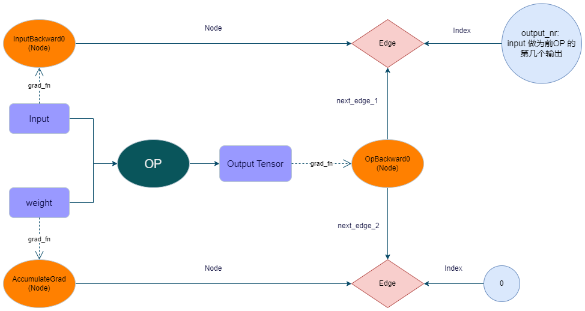

# Op autograd function
&nbsp;&nbsp;&nbsp;&nbsp;&nbsp;&nbsp;&nbsp;&nbsp;在 */pytorch/torch/csrc/autograd/generated/VariableType_*.cpp 文件中是为算子反向图注册之处。这里的函数都是自动生成的。在源码中找不到。以_conv_depwise2d为例。<br>

```c++
at::Tensor _conv_depthwise2d(c10::DispatchKeySet ks, const at::Tensor & self, const at::Tensor & weight, c10::SymIntArrayRef kernel_size, const ::std::optional<at::Tensor> & bias, c10::SymIntArrayRef stride, c10::SymIntArrayRef padding, c10::SymIntArrayRef dilation) {
  auto& self_ = unpack(self, "self", 0);
  auto& weight_ = unpack(weight, "weight", 1);
  [[maybe_unused]] auto _any_requires_grad = compute_requires_grad( self, weight, bias );

  std::shared_ptr<ConvDepthwise2DBackward0> grad_fn;

  // 如果需要计算梯度则在此处理
  if (_any_requires_grad) {
    grad_fn = std::shared_ptr<ConvDepthwise2DBackward0>(new ConvDepthwise2DBackward0(), deleteNode);
    grad_fn->set_next_edges(collect_next_edges( self, weight, bias ));
    grad_fn->bias_sym_sizes_opt = bias.has_value() ? std::optional<c10::SymIntArrayRef>(bias->sym_sizes()) : std::nullopt;
    grad_fn->dilation = dilation.vec();
    grad_fn->padding = padding.vec();
    grad_fn->self_ = SavedVariable(self, false);
    grad_fn->stride = stride.vec();
    grad_fn->weight_ = SavedVariable(weight, false);
  }
  #ifndef NDEBUG
  auto self__storage_saved =
    self_.has_storage() ? ::std::optional<Storage>(self_.storage()) : ::std::nullopt;
  c10::intrusive_ptr<TensorImpl> self__impl_saved;
  if (self_.defined()) self__impl_saved = self_.getIntrusivePtr();
  auto weight__storage_saved =
    weight_.has_storage() ? ::std::optional<Storage>(weight_.storage()) : ::std::nullopt;
  c10::intrusive_ptr<TensorImpl> weight__impl_saved;
  if (weight_.defined()) weight__impl_saved = weight_.getIntrusivePtr();
  #endif
  auto _tmp = ([&]() {
    if ((isFwGradDefined(self) || isFwGradDefined(weight) || isFwGradDefined(bias))) {
      static c10::OperatorName full_name("aten::_conv_depthwise2d", "");
      static ::std::optional<c10::OperatorHandle> opt_op = c10::Dispatcher::singleton().findSchema(full_name);
      return impl::run_jit_decomposition_with_args_for_jvp<at::Tensor>("_conv_depthwise2d", *opt_op, ks, self, weight, kernel_size, bias, stride, padding, dilation);
    } else {
      at::AutoDispatchBelowADInplaceOrView guard;
      return at::redispatch::_conv_depthwise2d_symint(ks & c10::after_autograd_keyset, self_, weight_, kernel_size, bias, stride, padding, dilation);
    }
  })();
  auto result = std::move(_tmp);
  #ifndef NDEBUG
  if (self__storage_saved.has_value() &&
      !at::impl::dispatch_mode_enabled() &&
      !at::impl::tensor_has_dispatch(self_) &&
      !at::impl::tensor_has_dispatch(self_))
    TORCH_INTERNAL_ASSERT(self__storage_saved.value().is_alias_of(self_.storage()));
  if (self__impl_saved && !at::impl::dispatch_mode_enabled() && !at::impl::tensor_has_dispatch(self_))
    TORCH_INTERNAL_ASSERT(self__impl_saved == self_.getIntrusivePtr());
  if (weight__storage_saved.has_value() &&
      !at::impl::dispatch_mode_enabled() &&
      !at::impl::tensor_has_dispatch(weight_) &&
      !at::impl::tensor_has_dispatch(weight_))
    TORCH_INTERNAL_ASSERT(weight__storage_saved.value().is_alias_of(weight_.storage()));
  if (weight__impl_saved && !at::impl::dispatch_mode_enabled() && !at::impl::tensor_has_dispatch(weight_))
    TORCH_INTERNAL_ASSERT(weight__impl_saved == weight_.getIntrusivePtr());
  if (result.has_storage() && !at::impl::dispatch_mode_enabled() && !at::impl::tensor_has_dispatch(result)) {
    TORCH_INTERNAL_ASSERT(result.storage().use_count() == 1, "function: _conv_depthwise2d");
  }
  if (!at::impl::dispatch_mode_enabled() && !at::impl::tensor_has_dispatch(result))
    TORCH_INTERNAL_ASSERT(result.use_count() <= 1, "function: _conv_depthwise2d");
  #endif
  if (grad_fn) {
      set_history(flatten_tensor_args( result ), grad_fn);
  }
  throw_error_for_complex_autograd(result, "_conv_depthwise2d");
  return result;
}
```

# 1 相关数据结构

## 1.1 Node 的定义

```c++
class Node {
 public:
    Node(...)
    Node(...)
    getptr(...)
    operator ()(...)
    input_metadata(...)
    mutable_input_metadata(...)
    stream(...)
    clear_input_metadata(...)
    update_topological_nr(...)
    set_next_edge(...)
    add_next_edge(...)
    set_next_edges(...)
    set_sequence_nr(...)
    should_compute_output(...)
    should_compute_output(...)
    task_should_compute_output(...)
    task_should_compute_output(...)
    add_post_hook(...)
    del_post_hook(...)
    add_pre_hook(...)
    add_tensor_pre_hook(...)
    add_retains_grad_hook(...)
    pop_retains_grad_hook(...)
    release_variables(...)
    will_release_variables(...)
    is_traceable(...)
    passes_state_transparently(...)
    compiled_args(...)
    apply_with_saved(...)

 protected:
  /// Performs the `Node`'s actual operation.
  virtual variable_list apply(variable_list&& inputs) = 0;

  /// 调用apply()，但使用追踪机制对其进行装备(instruments)。
  variable_list traced_apply(variable_list inputs);

  // 用于在profiler中将后向节点(nodes)与前向操作(ops)相关联的序列号，并在引擎中提供确定性。
  uint64_t sequence_nr_;

  // See NOTE [ Topological Number ]
  uint64_t topological_nr_ = 0;

  // 跟踪此节点是否已通过 set_next_edge(s) 被添加为另一个节点的 next_edge，
  // 该操作总是会调用其所有子节点的 topological_nr()
  // See NOTE [ Topological Number ] for why we need this.
  mutable bool has_parent_ = false;

  // Id of the thread that created the instance
  uint64_t thread_id_ = 0;

  // 自动求导节点的线程安全
  std::mutex mutex_;

  std::vector<Edge> next_edges_;
  PyObject* pyobj_ = nullptr; // weak reference
  std::unique_ptr<AnomalyMetadata> anomaly_metadata_ = nullptr;

  // 注意 [钩子顺序]
  // - pre_hooks 仅在节点自身被执行时才会执行。
  std::vector<std::unique_ptr<FunctionPreHook>> pre_hooks_;
  // - tensor_pre_hook 只要引擎遍历到该节点就会执行，即使该节点不会被执行。
  std::vector<std::unique_ptr<FunctionPreHook>> tensor_pre_hooks_;
  // - retains_grad_hook 类似于 tensor_pre_hooks，但总是排在所有其他 tensor_pre_hooks 之后。
  std::unordered_map<size_t, std::unique_ptr<FunctionPreHook>>
      retains_grad_hooks_;
  // 后处理钩子（post-hooks）: 这些钩子在自动求导节点执行完毕后被调用
  std::vector<std::unique_ptr<FunctionPostHook>> post_hooks_;
  at::SmallVector<InputMetadata, 2> input_metadata_;
}

```

## 1.2 Edge 的定义

```c++
namespace torch::autograd {

struct Node;

/// Represents a particular input of a function.
struct Edge {
  Edge() noexcept : function(nullptr), input_nr(0) {}

  Edge(std::shared_ptr<Node> function_, uint32_t input_nr_) noexcept
      : function(std::move(function_)), input_nr(input_nr_) {}

  /// Convenience method to test if an edge is valid.
  bool is_valid() const noexcept {
    return function != nullptr;
  }

  // Required for use in associative containers.
  bool operator==(const Edge& other) const noexcept {
    return this->function == other.function && this->input_nr == other.input_nr;
  }

  bool operator!=(const Edge& other) const noexcept {
    return !(*this == other);
  }

  /// Edge 所指向的function.
  std::shared_ptr<Node> function;

  /// 指代是function的第几个输入(The identifier of a particular input to the function).
  ///
  uint32_t input_nr;
};
} // namespace torch::autograd
```

## 1.3 autograd 中对grad_fn/Node的添加
```c++
  auto& self_ = unpack(self, "self", 0);
  auto& weight_ = unpack(weight, "weight", 1);
  [[maybe_unused]] auto _any_requires_grad = compute_requires_grad( self, weight, bias );

  std::shared_ptr<ConvDepthwise2DBackward0> grad_fn;
  if (_any_requires_grad) {
    grad_fn = std::shared_ptr<ConvDepthwise2DBackward0>(new ConvDepthwise2DBackward0(), deleteNode);
    grad_fn->set_next_edges(collect_next_edges( self, weight, bias ));
    grad_fn->bias_sym_sizes_opt = bias.has_value() ? std::optional<c10::SymIntArrayRef>(bias->sym_sizes()) : std::nullopt;
    grad_fn->dilation = dilation.vec();
    grad_fn->padding = padding.vec();
    grad_fn->self_ = SavedVariable(self, false);
    grad_fn->stride = stride.vec();
    grad_fn->weight_ = SavedVariable(weight, false);
  }
```

## 1.4 在set_history 中将grad_fn/Node attach 到 result 上
```c++
inline void set_history(
    const at::Tensor& result,
    const std::shared_ptr<Node>& grad_fn) {
  TORCH_CHECK(grad_fn != nullptr);
  if (variable.defined()) {
    // If the codegen triggers this, you most likely want to add your newly
    // added function to the DONT_REQUIRE_DERIVATIVE list in
    // tools/autograd/gen_variable_type.py
    TORCH_INTERNAL_ASSERT(isDifferentiableType(variable.scalar_type()));
    auto output_nr = grad_fn->add_input_metadata(variable);
    impl::set_gradient_edge(variable, {grad_fn, output_nr});
  } else {
    grad_fn->add_input_metadata(Node::undefined_input());
  }
}

void set_gradient_edge(const Variable& self, Edge edge) {
  auto* meta = materialize_autograd_meta(self);
  meta->grad_fn_ = std::move(edge.function);
  meta->output_nr_ = edge.input_nr;
  // For views, make sure this new grad_fn_ is not overwritten unless it is
  // necessary in the VariableHooks::grad_fn below. This logic is only relevant
  // for custom autograd Functions for which multiple operations can happen on a
  // given Tensor before its gradient edge is set when exiting the custom
  // Function.
  auto diff_view_meta = get_view_autograd_meta(self);
  if (diff_view_meta && diff_view_meta->has_bw_view()) {
    diff_view_meta->set_attr_version(self._version());
  }
}
```

# 2 Node 的连接关系图




# 3 为param 注册反向钩子函数
&nbsp;&nbsp;&nbsp;&nbsp;&nbsp;&nbsp;&nbsp;&nbsp; Parameter 为叶子节点直接用register_hook不能成功，因为叶子节点没有grad_fn/Node. 不过可以通过下面手段绕过限制。<br>

```python
for p in module.parameters(recurse=False):
    # Don't register hooks if param does not require grad
    if not p.requires_grad or (hasattr(p, "_ddp_ignored") and p._ddp_ignored):
        continue
    # We need to register autograd hook here instead of DDP's ctor
    # since we're working with the low precision param. Register them
    # via obtaining the gradient accumulator.
    tmp = p.expand_as(p)
    grad_acc = tmp.grad_fn.next_functions[0][0]

    hook = grad_acc.register_hook(
        functools.partial(self._fire_reducer_autograd_hook, p._idx)
    )
    p._ddp_mp_hook_state = (grad_acc, hook)
```

*通过expand_as 得到一个tmp tensor, 这个tmp tensor 作为activation(requires_grad=True) 存在grad_fn/Node, 然后可以通过它获取上一层的(grad_fn/Node, output_nr)* <br>
