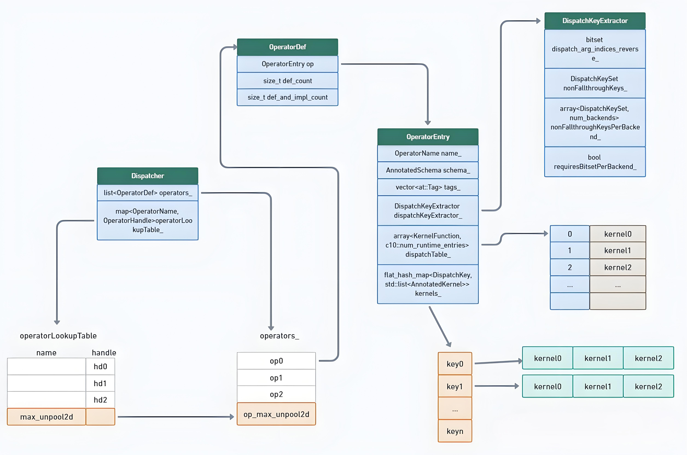

# 0 Dispatcher 总原理 
&nbsp;&nbsp;&nbsp;&nbsp;&nbsp;&nbsp;&nbsp;&nbsp;Dispatcher背后的一般原则是将operators的实现分成多个kernel，每个kernel对应特定的dispatch key(例如 CPU、CUDA). dispatcher确定在调用operator时最高优先级的调度键(dispatch key)是什么（这是通过查看张量参数以及一些线程本地状态来完成的），并将控制权转移到该调度键的kernel。最终效果是，当您调用一个operator时，我们首先执行 Autograd kernel，然后根据传入张量的device type重新调度(redispatch)到后端内核。<br>
- dispatch 的分发过程如下：
1. 首先会根据Tensor信息和上下文信息构建DispatchKeySet；
2. 确定优先级最高的DispatchKey，DispatchKeySet是按优先级高低排序好的，同时需要将DispatchKeySet转换为对应的DispatchKey；
3. 根据DispatchKey查找分发表，确定相应的kernel；
4. 如果找了相匹配的kernel，就执行kernel函数，如果没有匹配的kernel，可能会查找**fallback kernel**，或者根据**alias key**查找通用的kernel；

# 1 Dispatcher data structure

## 1.1 class Dispatcher
```c++
class TORCH_API Dispatcher final {
...
private:
    std::list<OperatorDef> operators_;
    LeftRight<ska::flat_hash_map<OperatorName, OperatorHandle>> operatorLookupTable_;
    ska::flat_hash_map<std::string, std::string> libraries_;
    std::array<impl::AnnotatedKernel, num_runtime_entries> backendFallbackKernels_;
    std::unique_ptr<detail::RegistrationListenerList> listeners_;
...
}
```

- operators_保存所有算子的定义信息;
- operatorLookupTable_保存所有算子的名称和对应的handle的映射关系;
- libraries_保存所有算子所依赖的库的名称和路径的映射关系;
- backendFallbackKernels_保存所有算子的后端fallback kernel的定义信息;
- listeners_保存所有注册监听器的列表;

## 1.2 class OperatorDef
&nbsp;&nbsp;&nbsp;&nbsp;&nbsp;&nbsp;&nbsp;&nbsp;另外，OperatorHandle 其实存储的是OperatorDef的句柄，OperatorDef 是 Dispatcher 类的核心数据结构：<br>

```c++
struct OperatorDef final {
    explicit OperatorDef(OperatorName&& op_name)
    : op(std::move(op_name)) {}
    impl::OperatorEntry op;
    size_t def_count = 0;
    size_t def_and_impl_count = 0;
  };
```

- op：包含了算子的实际kernel实现和相关元数据;
- def_count：这是一个引用计数器，用于跟踪操作符定义的注册次数。def_count 计数器仅反映通过 def() 注册的次数。在新的注册系统中，这个计数器通常只会是 1，但在旧的注册系统中，可能会由于多次注册同一个操作符的 schema 而增加。这个计数器用于确保在所有定义被反注册后，可以及时调用 Deregistered 监听器。<br>
- def_and_impl_count：这是一个引用计数器，用于跟踪操作符定义和实现的总注册次数。def_and_impl_count 计数器反映了通过 def() 和 impl() 注册的总次数。当最后一个 def() 注册被反注册时，需要立即调用 Deregistered 监听器，但不能删除操作符句柄，因为可能还有其他未完成的 RAII 析构函数需要使用这个句柄。<br>

## 1.3 class OperatorEntry
&nbsp;&nbsp;&nbsp;&nbsp;&nbsp;&nbsp;&nbsp;&nbsp;OperatorEntry 存储了算子的实际kernel实现和相关元数据，OperatorEntry 包含了算子的名称、schema、tags、dispatchTable、dispatchKeyExtractor、kernels等信息，其中dispatchTable存储了算子的kernel实现，dispatchKeyExtractor用于从输入的输入张量中提取dispatchKey，kernels存储了算子的不同backend的kernel实现。每个op的kernels真正存储在OperatorEntry中，其具体结构如下：<br>
```c++
class TORCH_API OperatorEntry final {
private:
    OperatorName name_;
    c10::optional<AnnotatedSchema> schema_;
    std::vector<at::Tag> tags_;
    std::array<KernelFunction, c10::num_runtime_entries> dispatchTable_;
    DispatchKeyExtractor dispatchKeyExtractor_;
    ska::flat_hash_map<DispatchKey,std::list<AnnotatedKernel>> kernels_;
}
```

**重点信息** <br>
- name_：算子名称;
- schema_：算子图式信息;
- tags_：算子标签 ;
- dispatchTable_：存储算子的分发表。分派表用于快速查找和调用与特定分派键关联的kernel函数。每个DispatchKey都有一个对应的kernel函数。 
- dispatchKeyExtractor_：用于从输入参数中提取DispatchKey，以便确定使用哪个kernel函数来处理oprator;
- kernels_： kernels_ 存储了对应 dispatch key 注册的所有 kernel，如果加载的算子库覆盖了已经存在的 kernel，这两个 kernel 都会在这个列表中，但只有新的那个会在dispatchTable 中。如果任何 kernel 被移除（比如库被卸载了），我们会从这个列表中移除 kernel 并在必要时更新dispatchTable。列表中的 kernel 按注册时间降序排列，新注册的在前面。<br>

**这个类有两个重点成员函数需要重点看下：**<br>

- registerSchema
&nbsp;&nbsp;&nbsp;&nbsp;&nbsp;&nbsp;&nbsp;&nbsp;这个函数相对比较简单，主要作用是为算子注册一个新的schema，并在分DispatchKeyExtractor中注册新的模式.<br>
```c++
void OperatorEntry::registerSchema(FunctionSchema&& schema, std::string&& debug, std::vector<at::Tag> tags) {
  TORCH_INTERNAL_ASSERT(!schema_.has_value());
  for (const auto& kernel : kernels_) {
    for (const auto &j : kernel.second) {
      if (j.inferred_function_schema != nullptr) {
        checkSchema(name_, schema, debug, j.kernel, *j.inferred_function_schema, j.debug);
      }
    }
  }
  // NB: don't register schema until after we've checked everything!
  dispatchKeyExtractor_.registerSchema(schema);
  schema_ = AnnotatedSchema(std::move(schema), std::move(debug));
  #ifndef C10_MOBILE
    tags_ = std::move(tags);
  #endif
}
```

- registerKernel
&nbsp;&nbsp;&nbsp;&nbsp;&nbsp;&nbsp;&nbsp;&nbsp;函数的作用主要是为算子注册一个内核函数，并更新相应的分发表. <br>
- 首先，根据DispatchKey将kernel函数添加到相应的kernel函数列表中。如果没有DispatchKey，则添加到 CompositeImplicitAutograd 列表中。
- 然后，根据条件添加或更新kernel函数，并获取新插入的kernel函数的迭代器，这里插入在列表的最前面.
- 最后，更新分发表。

```c++
OperatorEntry::AnnotatedKernelContainerIterator OperatorEntry::registerKernel(
  const c10::Dispatcher& dispatcher,
  c10::optional<DispatchKey> dispatch_key,
  KernelFunction kernel,
  c10::optional<CppSignature> cpp_signature,
  std::unique_ptr<FunctionSchema> inferred_function_schema,
  std::string debug
) {
  ...
  auto& k = dispatch_key.has_value() ? kernels_[*dispatch_key] : kernels_[DispatchKey::CompositeImplicitAutograd];

  ...

  k.emplace_front(std::move(kernel), std::move(inferred_function_schema), std::move(debug));

  AnnotatedKernelContainerIterator inserted = k.begin();
  // update the dispatch table, i.e. re-establish the invariant
  // that the dispatch table points to the newest kernel
  if (dispatch_key.has_value()) {
    updateDispatchTable_(dispatcher, *dispatch_key);
  } else {
    updateDispatchTableFull_(dispatcher);
  }
  return inserted;
}
```

## 1.4 class DispatchKeyExtractor
&nbsp;&nbsp;&nbsp;&nbsp;&nbsp;&nbsp;&nbsp;&nbsp;An instance of DispatchKeyExtractor knows how to get a dispatch key given a list of arguments for an operator call。
该类的实例是特定于某个操作符的，具体表现为：<br>
- 在boxed dispatch中，不同的操作符有不同的提取dispatch key的方式（例如，参数数量不同），并且我们会预先计算应该查看的栈位置；
- 在all dispatch中，有些后端应该从分发中排除，因为它们已被注册为fallthrough。被排除的后端集合因操作符而异，因为有些操作符可能已用自定义行为覆盖了“fallthrough”机制。

注意：此处应保持与PyTorch中pytorch/torch/dispatcher.py里的py dispatcher key extraction逻辑相同的实现。<br>

```c++
struct TORCH_API DispatchKeyExtractor final {
private:
    c10::utils::bitset dispatch_arg_indices_reverse_;
    DispatchKeySet nonFallthroughKeys_;
    std::array<DispatchKeySet, num_backends> nonFallthroughKeysPerBackend_;
    bool requiresBitsetPerBackend_;
}
```

- dispatch_arg_indices_reverse_：一个bit set(用long long 类型来表示)，表示需要进行分发的参数索引。位按逆序存储，即dispatch_arg_indices_reverse_[i] == true 表示从栈顶开始的第i个参数（即函数的倒数第i个参数）对于分发是相关的。<br>
- nonFallthroughKeys_：一个functionality set，表示operator 没有 fallthrough kernel的key;
- nonFallthroughKeysPerBackend_：一个数组，每个元素是一个functionality set，表示operator在不同后端中没有 fallthrough 内核的键;
- requiresBitsetPerBackend_：一个标志，指示是否需要检查 nonFallthroughKeysPerBackend_ 数组。

&nbsp;&nbsp;&nbsp;&nbsp;&nbsp;&nbsp;&nbsp;&nbsp;DispatchKeyExtractor 中的两个重要函数 : getDispatchKeySetBoxed/getDispatchKeySetUnboxed, 在这两个重要函数中会计算最终的DispatchKeySet，计算过程主要有两个步骤：<br>

- 计算多个输入参数的组合DispatchKeySet : <br>
```c++
  template <typename... Args>
  DispatchKeySet multi_dispatch_key_set(const Args&... args) {
    return MultiDispatchKeySet().apply(args...).ts;
  }都会调用 impl::computeDispatchKeySet**<br>
```

- 考虑local.include local.exclude mask_key 后最终的 DispatchKeySet, 实现如下 :
```c++
static inline DispatchKeySet computeDispatchKeySet(
    DispatchKeySet ks,

    // key_mask 允许我们忽略不应考虑的分发键。有两种情况使用此功能：
    // 1. 如果一个operator的dispatch table 包含fallthrough 条目，我们在查找key时应完全绕过它;
    // 2. 如果用户使用重新分派，则mask可用于将用户要求停止的键设置为零。
    // 这些被排除的后端不会在TLS中被追踪，但必须在TLS之后应用（因为包含的TLS可能会引入该后端以供考虑),
    // 这就是为什么您需要将它们传递给这个函数（而不是直接应用到输入'ks'上）的原因。
    DispatchKeySet key_mask
) {
  c10::impl::LocalDispatchKeySet local = c10::impl::tls_local_dispatch_key_set();
 
  // TODO: 待办事项：我们在这里不得不进行逻辑或运算，这有点烦人。如果只需要进行一次就好了。
  // 能把always_included合并到TLS中吗？嗯，这有点麻烦，因为快速路径TLS访问要求相关的TLS类型必须被零初始化，
  // 所以在这种情况下你实际上并没有获得任何好处。
  return (((ks | local.included_) - local.excluded_) & key_mask);
}
```

**问题：local.include_ 和 local.exclud_ 这两个成员变量如何得到的呢？** <br>

## 1.5 local.include_ 和 local.exclude_ 以及 key_mask
&nbsp;&nbsp;local.include_ 和 local.exclude_ 这两个成员变量是由c10::impl::tls_local_dispatch_key_set()函数初始化的，该函数会在每个线程中初始化一个c10::impl::LocalDispatchKeySet对象，该对象包含两个成员变量：include_ 和 exclude_，分别表示要包含和要排除的DispatchKeySet。<br>

```c++
// 影响运算的全局变量，由运行时用户设置的context或者中间Dispatch决定其值
struct C10_API PODLocalDispatchKeySet {
  uint64_t included_;
  uint64_t excluded_;
};

extern C10_API thread_local PODLocalDispatchKeySet raw_local_dispatch_key_set;

inline C10_API LocalDispatchKeySet tls_local_dispatch_key_set() {
  // Don't let people fiddle with the thread_local directly just
  // because they include this header.
  return raw_local_dispatch_key_set;
}
```

**key_mask** <br>
&nbsp;&nbsp;&nbsp;&nbsp;&nbsp;&nbsp;&nbsp;&nbsp; 无论中间handler还是最终handler，会注册到library中。**针对每个具有相同OperatorName的handler,会初始化一个key_mask**,
初始值为DispatchKeySet的全集，并根据注册情况加以修改。它的含义是表示当前的dispatch key 对应的handler**不是fallthrough 的kernel。** <br>

它修改的逻辑是，对于当前的dispatch key, 如果找到对应的handler是fallthrough的，则将该dispatch key 从nonFallthroughKeys中移除。<br>
```c++
if (has_fallthrough) {
  nonFallthroughKeys_ = nonFallthroughKeys_.remove(k);
} else {
  nonFallthroughKeys_ = nonFallthroughKeys_.add(k);
}
```


