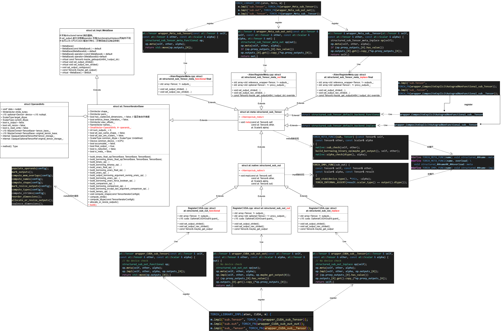
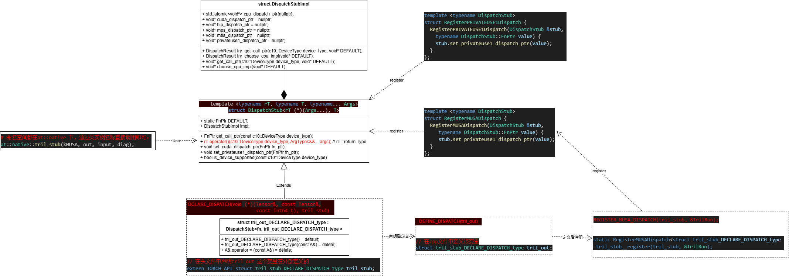

# 0 structured op introduction
**pytorch 中算子定义有三种范式:** <br>
- functional 规则：由于尺寸变化、类型转换或数据依赖等原因，算子的实现通常会先在内部创建临时变量，计算结果写入完成后作为结果返回，称为 functional 规则；
- inplace 规则: 输入 a 是可读写的，计算完成后数据被覆盖;
- out 规则: 计算结果写入外部提前创建好的变量 b.

**example:** <br>
```python
Tensor tril(const Tensor&, int64_t); // functional
Tensor& tril_(Tensor&, int64_t); // inplace
Tensor& tril_out(const Tensor&, int64_t, Tensor&); // out
```

&nbsp;&nbsp;&nbsp;&nbsp;&nbsp;&nbsp;&nbsp;&nbsp;Python 调用对应多种规则的 C++ 算子，称为一个 group；调用后，在 group 内选择对应的 C++ 算子进行派发。从实现角度看，不同的调用规则除了预处理有区别之外，计算逻辑是一致的。因此，PyTorch针对 group 算子引入了 structured 的实现方式，整体逻辑拆分为预处理和计算两个子过程，这样的好处是：<br>

- 预处理过程屏蔽调用规则的逻辑差异，对外不区分后端，甚至算子类型。
- 计算过程不区分调用规则，每个后端只需要实现一个计算函数。
- 算子实现的**外层逻辑**（预处理 + 计算）一致，可由 codegen 生成。

&nbsp;&nbsp;&nbsp;&nbsp;&nbsp;&nbsp;&nbsp;&nbsp;structured 的实现方式可以减少代码体积，实现高效的跨规则/跨算子逻辑复用，减少算子实现的工作量。与之相反，只有一种调用规则的算子，对应 unstructured 的实现方式（不存在多种调用规则的逻辑区别），开发者可以尝试复用已有的 structured 子过程，也可以独立实现整个算子逻辑。<br>

# 1 structured op definition in pytorch
## 1.1 native_functions.yaml 中对structured op的声明
- structured op 在native_functions.yaml 中定义如下
```yaml
- func: add.Tensor(Tensor self, Tensor other, *, Scalar alpha=1) -> Tensor
  device_check: NoCheck   # TensorIterator
  structured_delegate: add.out
  variants: function, method
  dispatch:
    SparseCPU, SparseCUDA, SparseMeta: add_sparse
    SparseCsrCPU, SparseCsrCUDA, SparseCsrMeta: add_sparse_csr
    MkldnnCPU: mkldnn_add
    ZeroTensor: add_zerotensor
    NestedTensorCPU, NestedTensorCUDA: NestedTensor_add_Tensor
  tags: [core, pointwise]

- func: add_.Tensor(Tensor(a!) self, Tensor other, *, Scalar alpha=1) -> Tensor(a!)
  device_check: NoCheck   # TensorIterator
  variants: method
  structured_delegate: add.out
  dispatch:
    SparseCPU, SparseCUDA, SparseMeta: add_sparse_
    SparseCsrCPU, SparseCsrCUDA, SparseCsrMeta: add_sparse_csr_
    MkldnnCPU: mkldnn_add_
    NestedTensorCPU, NestedTensorCUDA: NestedTensor_add__Tensor
  tags: pointwise

- func: add.out(Tensor self, Tensor other, *, Scalar alpha=1, Tensor(a!) out) -> Tensor(a!)
  device_check: NoCheck   # TensorIterator
  structured: True
  structured_inherits: TensorIteratorBase
  ufunc_inner_loop:
    Generic: add (AllAndComplex, BFloat16, Half, ComplexHalf)
    ScalarOnly: add (Bool)
  dispatch:
    SparseCPU, SparseMeta: add_out_sparse_cpu
    SparseCUDA: add_out_sparse_cuda
    SparseCsrCPU, SparseCsrMeta: add_out_sparse_compressed_cpu
    SparseCsrCUDA: add_out_sparse_compressed_cuda
    MkldnnCPU: mkldnn_add_out
    MPS: add_out_mps
  tags: pointwise
```

## 1.2 每个后端对structured op 采用统一的warpper 方式
- structuer op 有统一的实现方式： 先 计算 meta 后 进行 impl
```c++
// 自动生成的代码: build/aten/src/ATen/RegisterCUDA.cpp
at::Tensor & wrapper_CUDA_add_out_out(const at::Tensor & self, const at::Tensor & other, const at::Scalar & alpha, at::Tensor & out) {
  // No device check
structured_ufunc_add_CUDA_out op(out);
op.meta(self, other, alpha);
op.impl(self, other, alpha, op.maybe_get_output(0));
if (op.proxy_outputs_[0].has_value()) op.outputs_[0].get().copy_(*op.proxy_outputs_[0]);
return out;
}
```

## 1.3 structured op 的注册
- 在 */pytorch/build/aten/src/ATen/RegisterCUDA.cpp 下完成注册
```c++
TORCH_LIBRARY_IMPL(aten, CUDA, m) {
m.impl("add.Tensor", TORCH_FN(wrapper_CUDA_add_Tensor));
m.impl("add.out", TORCH_FN(wrapper_CUDA_add_out_out));
m.impl("add_.Tensor", TORCH_FN(wrapper_CUDA_add__Tensor));
}
```

- 同时这些函数还直接实现在*/pytorch/build/aten/src/ATen/RegisterCUDA.cpp 下 at::cuda命名空间下，并在

```c++
at::Tensor add(const at::Tensor & self, const at::Tensor & other, const at::Scalar & alpha) {
return wrapper_CUDA_add_Tensor(self, other, alpha);
}
at::Tensor & add_out(at::Tensor & out, const at::Tensor & self, const at::Tensor & other, const at::Scalar & alpha) {
return wrapper_CUDA_add_out_out(self, other, alpha, out);
}
at::Tensor & add_outf(const at::Tensor & self, const at::Tensor & other, const at::Scalar & alpha, at::Tensor & out) {
return wrapper_CUDA_add_out_out(self, other, alpha, out);
}
```
- 这些函数的声明发生在：*/pytorch/torch/include/ATen/ops/add_cuda_dispatch.h , 通过这个接口我们可以不通过dispatch而直接调用这些函数。
```c++
#pragma once
// @generated by torchgen/gen.py from DispatchKeyFunction.h

// NB: The implementing C++ file is RegisterDispatchKey.cpp

// The only #includes we need are for custom classes that have defaults in the C++ API
#include <c10/core/MemoryFormat.h>
#include <c10/core/Scalar.h>
#include <ATen/core/Reduction.h>

// Forward declarations of any types needed in the operator signatures.
// We can't directly include these classes because it will cause circular include dependencies.
// This file is included by TensorBody.h, which defines the Tensor class.
#include <ATen/core/ATen_fwd.h>

namespace at {

namespace cuda {

TORCH_API at::Tensor add(const at::Tensor & self, const at::Tensor & other, const at::Scalar & alpha=1);
TORCH_API at::Tensor & add_out(at::Tensor & out, const at::Tensor & self, const at::Tensor & other, const at::Scalar & alpha=1);
TORCH_API at::Tensor & add_outf(const at::Tensor & self, const at::Tensor & other, const at::Scalar & alpha, at::Tensor & out);
TORCH_API at::Tensor & add_(at::Tensor & self, const at::Tensor & other, const at::Scalar & alpha=1);

} // namespace cuda
} // namespace at
```

## 1.4 其他相关文件
- */pytorch/build/aten/src/ATen/ops/add_meta.h ：struct meta 结构体的声明
```c++
#pragma once

// @generated by torchgen/gen.py from NativeMetaFunction.h

#include <c10/core/Scalar.h>
#include <c10/core/Storage.h>
#include <c10/core/TensorOptions.h>
#include <c10/util/Deprecated.h>
#include <optional>
#include <c10/core/QScheme.h>
#include <ATen/core/Reduction.h>
#include <ATen/TensorIterator.h>
#include <ATen/TensorMeta.h>
#include <tuple>
#include <vector>

namespace at {
namespace meta {

struct TORCH_API structured_add_Tensor : public TensorIteratorBase {
    
    
    void meta(const at::Tensor & self, const at::Tensor & other, const at::Scalar & alpha);
};

} // namespace native
} // namespace at
```

- */pytorch/torch/include/ATen/ops/add_native.h ： structured op impl 结构体的声明
```c++
#pragma once

// @generated by torchgen/gen.py from NativeFunction.h

#include <c10/core/Scalar.h>
#include <c10/core/Storage.h>
#include <c10/core/TensorOptions.h>
#include <c10/util/Deprecated.h>
#include <optional>
#include <c10/core/QScheme.h>
#include <ATen/core/Reduction.h>
#include <ATen/core/Tensor.h>
#include <tuple>
#include <vector>
#include <ATen/ops/add_meta.h>

namespace at {
namespace native {
struct TORCH_API structured_ufunc_add_CPU : public at::meta::structured_add_Tensor {
void impl(const at::Tensor & self, const at::Tensor & other, const at::Scalar & alpha, const at::Tensor & out);
};
struct TORCH_API structured_ufunc_add_CUDA : public at::meta::structured_add_Tensor {
void impl(const at::Tensor & self, const at::Tensor & other, const at::Scalar & alpha, const at::Tensor & out);
};
TORCH_API at::Tensor NestedTensor_add_Tensor(const at::Tensor & self, const at::Tensor & other, const at::Scalar & alpha=1);
TORCH_API at::Tensor & NestedTensor_add__Tensor(at::Tensor & self, const at::Tensor & other, const at::Scalar & alpha=1);
TORCH_API at::Tensor add_sparse(const at::Tensor & self, const at::Tensor & other, const at::Scalar & alpha=1);
TORCH_API at::Tensor & add_out_sparse_cpu(const at::Tensor & self, const at::Tensor & other, const at::Scalar & alpha, at::Tensor & out);
TORCH_API at::Tensor & add_sparse_(at::Tensor & self, const at::Tensor & other, const at::Scalar & alpha=1);
TORCH_API at::Tensor & add_out_sparse_cuda(const at::Tensor & self, const at::Tensor & other, const at::Scalar & alpha, at::Tensor & out);
TORCH_API at::Tensor add_sparse_csr(const at::Tensor & self, const at::Tensor & other, const at::Scalar & alpha=1);
TORCH_API at::Tensor & add_out_sparse_compressed_cpu(const at::Tensor & self, const at::Tensor & other, const at::Scalar & alpha, at::Tensor & out);
TORCH_API at::Tensor & add_sparse_csr_(at::Tensor & self, const at::Tensor & other, const at::Scalar & alpha=1);
TORCH_API at::Tensor & add_out_sparse_compressed_cuda(const at::Tensor & self, const at::Tensor & other, const at::Scalar & alpha, at::Tensor & out);
TORCH_API at::Tensor mkldnn_add(const at::Tensor & self, const at::Tensor & other, const at::Scalar & alpha=1);
TORCH_API at::Tensor & mkldnn_add_out(const at::Tensor & self, const at::Tensor & other, const at::Scalar & alpha, at::Tensor & out);
TORCH_API at::Tensor & mkldnn_add_(at::Tensor & self, const at::Tensor & other, const at::Scalar & alpha=1);
TORCH_API at::Tensor add_zerotensor(const at::Tensor & self, const at::Tensor & other, const at::Scalar & alpha=1);
TORCH_API at::Tensor add(const at::Tensor & self, const at::Scalar & other, const at::Scalar & alpha=1);
TORCH_API at::Tensor & add_Scalar_out(const at::Tensor & self, const at::Scalar & other, const at::Scalar & alpha, at::Tensor & out);
TORCH_API at::Tensor & add_(at::Tensor & self, const at::Scalar & other, const at::Scalar & alpha=1);
} // namespace native
} // namespace at
```

- */pytorch/build/aten/src/ATen/ops/add_ops.h : 算子 call 和 redispatch 封装类的声明
```c++
#pragma once

// @generated by torchgen/gen.py from Operator.h

#include <tuple>
#include <vector>

// Forward declarations of any types needed in the operator signatures.
// We can't directly include these classes because it will cause circular include dependencies.
// This file is included by TensorBody.h, which defines the Tensor class.
#include <ATen/core/ATen_fwd.h>

namespace at {
namespace _ops {


struct TORCH_API add_Tensor {
  using schema = at::Tensor (const at::Tensor &, const at::Tensor &, const at::Scalar &);
  using ptr_schema = schema*;
  // See Note [static constexpr char* members for windows NVCC]
  STATIC_CONSTEXPR_STR_INL_EXCEPT_WIN_CUDA(name, "aten::add")
  STATIC_CONSTEXPR_STR_INL_EXCEPT_WIN_CUDA(overload_name, "Tensor")
  STATIC_CONSTEXPR_STR_INL_EXCEPT_WIN_CUDA(schema_str, "add.Tensor(Tensor self, Tensor other, *, Scalar alpha=1) -> Tensor")
  static at::Tensor call(const at::Tensor & self, const at::Tensor & other, const at::Scalar & alpha);
  static at::Tensor redispatch(c10::DispatchKeySet dispatchKeySet, const at::Tensor & self, const at::Tensor & other, const at::Scalar & alpha);
};

struct TORCH_API add__Tensor {
  using schema = at::Tensor & (at::Tensor &, const at::Tensor &, const at::Scalar &);
  using ptr_schema = schema*;
  // See Note [static constexpr char* members for windows NVCC]
  STATIC_CONSTEXPR_STR_INL_EXCEPT_WIN_CUDA(name, "aten::add_")
  STATIC_CONSTEXPR_STR_INL_EXCEPT_WIN_CUDA(overload_name, "Tensor")
  STATIC_CONSTEXPR_STR_INL_EXCEPT_WIN_CUDA(schema_str, "add_.Tensor(Tensor(a!) self, Tensor other, *, Scalar alpha=1) -> Tensor(a!)")
  static at::Tensor & call(at::Tensor & self, const at::Tensor & other, const at::Scalar & alpha);
  static at::Tensor & redispatch(c10::DispatchKeySet dispatchKeySet, at::Tensor & self, const at::Tensor & other, const at::Scalar & alpha);
};

struct TORCH_API add_out {
  using schema = at::Tensor & (const at::Tensor &, const at::Tensor &, const at::Scalar &, at::Tensor &);
  using ptr_schema = schema*;
  // See Note [static constexpr char* members for windows NVCC]
  STATIC_CONSTEXPR_STR_INL_EXCEPT_WIN_CUDA(name, "aten::add")
  STATIC_CONSTEXPR_STR_INL_EXCEPT_WIN_CUDA(overload_name, "out")
  STATIC_CONSTEXPR_STR_INL_EXCEPT_WIN_CUDA(schema_str, "add.out(Tensor self, Tensor other, *, Scalar alpha=1, Tensor(a!) out) -> Tensor(a!)")
  static at::Tensor & call(const at::Tensor & self, const at::Tensor & other, const at::Scalar & alpha, at::Tensor & out);
  static at::Tensor & redispatch(c10::DispatchKeySet dispatchKeySet, const at::Tensor & self, const at::Tensor & other, const at::Scalar & alpha, at::Tensor & out);
};

struct TORCH_API add_Scalar {
  using schema = at::Tensor (const at::Tensor &, const at::Scalar &, const at::Scalar &);
  using ptr_schema = schema*;
  // See Note [static constexpr char* members for windows NVCC]
  STATIC_CONSTEXPR_STR_INL_EXCEPT_WIN_CUDA(name, "aten::add")
  STATIC_CONSTEXPR_STR_INL_EXCEPT_WIN_CUDA(overload_name, "Scalar")
  STATIC_CONSTEXPR_STR_INL_EXCEPT_WIN_CUDA(schema_str, "add.Scalar(Tensor self, Scalar other, Scalar alpha=1) -> Tensor")
  static at::Tensor call(const at::Tensor & self, const at::Scalar & other, const at::Scalar & alpha);
  static at::Tensor redispatch(c10::DispatchKeySet dispatchKeySet, const at::Tensor & self, const at::Scalar & other, const at::Scalar & alpha);
};

struct TORCH_API add__Scalar {
  using schema = at::Tensor & (at::Tensor &, const at::Scalar &, const at::Scalar &);
  using ptr_schema = schema*;
  // See Note [static constexpr char* members for windows NVCC]
  STATIC_CONSTEXPR_STR_INL_EXCEPT_WIN_CUDA(name, "aten::add_")
  STATIC_CONSTEXPR_STR_INL_EXCEPT_WIN_CUDA(overload_name, "Scalar")
  STATIC_CONSTEXPR_STR_INL_EXCEPT_WIN_CUDA(schema_str, "add_.Scalar(Tensor(a!) self, Scalar other, Scalar alpha=1) -> Tensor(a!)")
  static at::Tensor & call(at::Tensor & self, const at::Scalar & other, const at::Scalar & alpha);
  static at::Tensor & redispatch(c10::DispatchKeySet dispatchKeySet, at::Tensor & self, const at::Scalar & other, const at::Scalar & alpha);
};

struct TORCH_API add_Scalar_out {
  using schema = at::Tensor & (const at::Tensor &, const at::Scalar &, const at::Scalar &, at::Tensor &);
  using ptr_schema = schema*;
  // See Note [static constexpr char* members for windows NVCC]
  STATIC_CONSTEXPR_STR_INL_EXCEPT_WIN_CUDA(name, "aten::add")
  STATIC_CONSTEXPR_STR_INL_EXCEPT_WIN_CUDA(overload_name, "Scalar_out")
  STATIC_CONSTEXPR_STR_INL_EXCEPT_WIN_CUDA(schema_str, "add.Scalar_out(Tensor self, Scalar other, Scalar alpha=1, *, Tensor(a!) out) -> Tensor(a!)")
  static at::Tensor & call(const at::Tensor & self, const at::Scalar & other, const at::Scalar & alpha, at::Tensor & out);
  static at::Tensor & redispatch(c10::DispatchKeySet dispatchKeySet, const at::Tensor & self, const at::Scalar & other, const at::Scalar & alpha, at::Tensor & out);
};

}} // namespace at::_ops
```

- */pytorch/build/aten/src/ATen/Operators_2.cpp : 上述op struct 的实现，主要是通过实现call 和 redispatch两个函数，具体实现是通过dispatch 机制来进行的。

```c++
// aten::add.Tensor(Tensor self, Tensor other, *, Scalar alpha=1) -> Tensor
static C10_NOINLINE c10::TypedOperatorHandle<add_Tensor::schema> create_add_Tensor_typed_handle() {
  return c10::Dispatcher::singleton()
      .findSchemaOrThrow(add_Tensor::name, add_Tensor::overload_name)
      .typed<add_Tensor::schema>();
}

// aten::add.Tensor(Tensor self, Tensor other, *, Scalar alpha=1) -> Tensor
at::Tensor add_Tensor::call(const at::Tensor & self, const at::Tensor & other, const at::Scalar & alpha) {
    
    static auto op = create_add_Tensor_typed_handle();
    return op.call(self, other, alpha);
}

// aten::add.Tensor(Tensor self, Tensor other, *, Scalar alpha=1) -> Tensor
at::Tensor add_Tensor::redispatch(c10::DispatchKeySet dispatchKeySet, const at::Tensor & self, const at::Tensor & other, const at::Scalar & alpha) {
    
    static auto op = create_add_Tensor_typed_handle();
    return op.redispatch(dispatchKeySet, self, other, alpha);
}
```

- */pytorch/build/aten/src/ATen/ops/add.h c++ 侧add 函数顶层的派发入口
```c++
#pragma once

// @generated by torchgen/gen.py from Function.h

#include <ATen/Context.h>
#include <ATen/DeviceGuard.h>
#include <ATen/TensorUtils.h>
#include <ATen/TracerMode.h>
#include <ATen/core/Generator.h>
#include <ATen/core/Reduction.h>
#include <ATen/core/Tensor.h>
#include <c10/core/Scalar.h>
#include <c10/core/Storage.h>
#include <c10/core/TensorOptions.h>
#include <c10/util/Deprecated.h>
#include <optional>


#include <ATen/ops/add_ops.h>

namespace at {


// aten::add.Tensor(Tensor self, Tensor other, *, Scalar alpha=1) -> Tensor
inline at::Tensor add(const at::Tensor & self, const at::Tensor & other, const at::Scalar & alpha=1) {
    return at::_ops::add_Tensor::call(self, other, alpha);
}

// aten::add.out(Tensor self, Tensor other, *, Scalar alpha=1, Tensor(a!) out) -> Tensor(a!)
inline at::Tensor & add_out(at::Tensor & out, const at::Tensor & self, const at::Tensor & other, const at::Scalar & alpha=1) {
    return at::_ops::add_out::call(self, other, alpha, out);
}
// aten::add.out(Tensor self, Tensor other, *, Scalar alpha=1, Tensor(a!) out) -> Tensor(a!)
inline at::Tensor & add_outf(const at::Tensor & self, const at::Tensor & other, const at::Scalar & alpha, at::Tensor & out) {
    return at::_ops::add_out::call(self, other, alpha, out);
}

// aten::add.Scalar(Tensor self, Scalar other, Scalar alpha=1) -> Tensor
inline at::Tensor add(const at::Tensor & self, const at::Scalar & other, const at::Scalar & alpha=1) {
    return at::_ops::add_Scalar::call(self, other, alpha);
}

// aten::add.Scalar_out(Tensor self, Scalar other, Scalar alpha=1, *, Tensor(a!) out) -> Tensor(a!)
inline at::Tensor & add_out(at::Tensor & out, const at::Tensor & self, const at::Scalar & other, const at::Scalar & alpha=1) {
    return at::_ops::add_Scalar_out::call(self, other, alpha, out);
}
// aten::add.Scalar_out(Tensor self, Scalar other, Scalar alpha=1, *, Tensor(a!) out) -> Tensor(a!)
inline at::Tensor & add_outf(const at::Tensor & self, const at::Scalar & other, const at::Scalar & alpha, at::Tensor & out) {
    return at::_ops::add_Scalar_out::call(self, other, alpha, out);
}

}
```

# 2 structured op related class
## 2.1 UML 图
&nbsp;&nbsp;&nbsp;&nbsp;&nbsp;&nbsp;&nbsp;&nbsp; structured op 的相关类的实现UML图如下：<br>



## 2.2 调用说明
- 通过 TORCH_META_FUNC 或 TORCH_META_FUNC2 和 TORCH_IMPL_FUNC 的宏定义都在：<br>
&nbsp;&nbsp;&nbsp;&nbsp;&nbsp;&nbsp;&nbsp;&nbsp;详见：*pytorch/torch/include/ATen/TensorMeta.h
- TORCH_META_FUNC2 和 TORCH_IMPL_FUNC 对sub_out 的使用都在：<br>
&nbsp;&nbsp;&nbsp;&nbsp;&nbsp;&nbsp;&nbsp;&nbsp; */pytorch/aten/src/ATen/native/BinaryOps.cpp

## 2.3 在调用时stub 时可能会调用其他算子的stub
- sub_out 里调用的是add_sub, 因此sub_out 算子不需要注册
```c++
TORCH_IMPL_FUNC(sub_out) (
  const Tensor& self, const Tensor& other, const Scalar& alpha, const Tensor& result
) {
  add_stub(device_type(), *this, -alpha);
  TORCH_INTERNAL_ASSERT(result.scalar_type() == output().dtype());
}
```

# 3 多种后端的func实现通过stub mode统一管理

## 3.1 */pytorch/torch/include/ATen/native/DispatchStub.h 类 UML 图


## 3.1 stub 声明位置
- *pytorch/aten/src/ATen/native/BinaryOps.h
- 命名空间：  at::native
```c++
// 59
DECLARE_DISPATCH(structured_binary_fn_alpha, sub_stub);
```

## 3.2 注册位置
- 文件路径：*/pytorch/aten/src/ATen/native/BinaryOps.cpp
- 命名空间：at::native
```c++
namespace at::native {

DEFINE_DISPATCH(add_clamp_stub);
DEFINE_DISPATCH(mul_stub);
DEFINE_DISPATCH(sub_stub);
}
```

## 3.3 注册位置
- build/aten/src/ATen/UfuncCUDA_add.cu
- 命名空间：at::native
```cu
REGISTER_DISPATCH(add_stub, &add_kernel);
```

- build/aten/src/ATen/UfuncCPUKernel_add.cpp
- 命名空间：anonymous
```c++
REGISTER_DISPATCH(add_stub, &add_kernel);;
```