# 1 DGX-2 介绍

- [参考链接](https://old.hotchips.org/hc30/2conf/2.01_Nvidia_NVswitch_HotChips2018_DGX2NVS_Final.pdf)

**Deep Learning GPU Supercomputer eXtreme（深度学习 GPU 超级计算机极致版）**

DGX-2 是 NVIDIA 在 2018 年推出的一款专为人工智能和高性能计算设计的集成式超级计算机。它是 DGX 系列产品线中的一个重要里程碑，代表了当时最强大的 AI 基础设施之一。

NVIDIA DGX-2 是一款专为极致 AI 性能设计的集成式超级计算机。它通过整合 **16 颗 Tesla V100** Tensor Core GPU 和革命性的 **NVSwitch** 全互连技术，在单个节点内提供了前所未有的计算能力和通信带宽，并辅以优化的软件栈，使其成为训练大型复杂 AI 模型的强大平台。虽然它已被更新的 DGX 型号取代，但**在 AI 基础设施发展史上占有重要地位**。

重要配置项： 

> 核心是 16 颗 NVIDIA Tesla V100 Tensor Core GPU(32GB SXM3 版本);
> Tesla V100 基于 Volta 架构，拥有强大的 FP16、FP32 和 FP64 计算能力，并引入了革命性的 Tensor Core，专门用于加速深度学习的矩阵运算（如混合精度训练和推理）;
> 每颗 V100 拥有 5120 个 CUDA 核心和 640 个 Tensor Core;
> 总共提供 **2 PetaFLOPS** 的 FP16 Tensor Core 性能或 125 TeraFLOPS 的深度学习性能;
> DGX-2 最大的技术创新在于其内部的 NVSwitch 高速互连结构;
> NVSwitch 是一个全连接、非阻塞的交换网络，允许所有 16 颗 GPU 以高达 **300 GB/s 的双向带宽**直接相互通信
> cpu: 配备两颗高性能的 Intel Xeon Platinum 处理器 (具体型号可能因配置而异);
> 内存：系统内存高达 1.5 TB，为处理海量数据集提供充足空间;
> 高速存储：内置 30 TB 的 NVMe SSD 存储，提供极高的数据读写速度，减少 I/O 瓶颈，加速训练和推理过程中的数据加载
> 开箱即用的软件栈：Ubuntu Linux、NVIDIA GPU Driver、CUDA/cuDNN/NCCL、TensorRT、Tensorflow/Pytorch/MXNet 、 NVIDIA 系统管理软件

**后续发展**  

它是后续更强大 DGX 系统（如基于 A100 GPU 的 **DGX A100** 和基于 H100 GPU 的 **DGX H100**）的重要先驱。这些后续产品在 GPU 架构（Ampere, Hopper）、互连带宽（NVSwitch 升级版）、内存容量和存储速度等方面都实现了显著提升。

# 2 COMM Between GPUs

## 2.1 TWO GPUS WITH PCIE

- 对其他GPU的HBM2访问处于PCIe带宽（32 GBps（双向） pcie3， 之后版本已大幅上升）；
- CPU之间的交互与GPU到GPU的交互存在竞争关系；
- PCIE类似"狂野西部"，有很多性能强盗，直接导致性能下降；

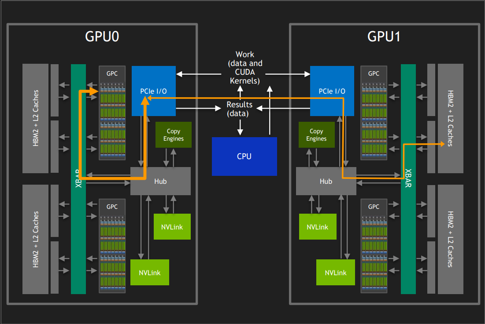

## 2.2 TWO GPUS WITH NVLINK

- 访问其他GPU的HBM2时，带宽为多条NVLink的总和（在V100 GPU中，双向带宽为300 GBps）；
- NVLinks 本质上是 XBARs 之间的“桥梁”;
- 没有与PCIe流量的冲突;

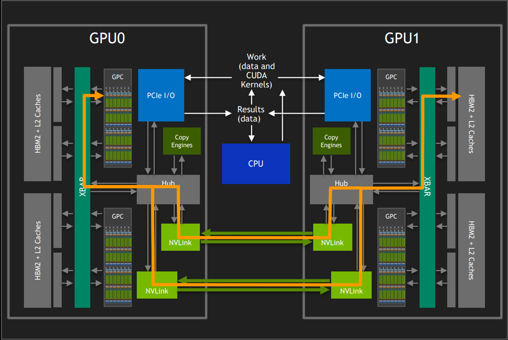

# 3 NVSwitch一个理想的巨型GPU(THE “ONE GIGANTIC GPU” IDEAL)

## 3.1 arch

- 可能的最高GPU数量;
- **单个GPU驱动程序进程**控制所有GPU上的所有工作;
- 从GPCs的角度来看，所有HBM2都可以在没有其他进程（LD/ST指令、复制引擎RDMA等）干预的情况下被访问，一切“正常工作”。

> 注释：传统多 GPU 系统中，跨 GPU 数据传输通常需要依赖复制引擎（Copy Engine）或 RDMA（远程直接内存访问）等机制，在 DGX-2 中，NVSwitch 和统一地址空间消除了这些需求，简化了编程模型.

- 对所有HBM2s内存的访问不依赖于PCIe
- 跨桥接XBAR的带宽尽可能高（某些NUMA是不可避免的）

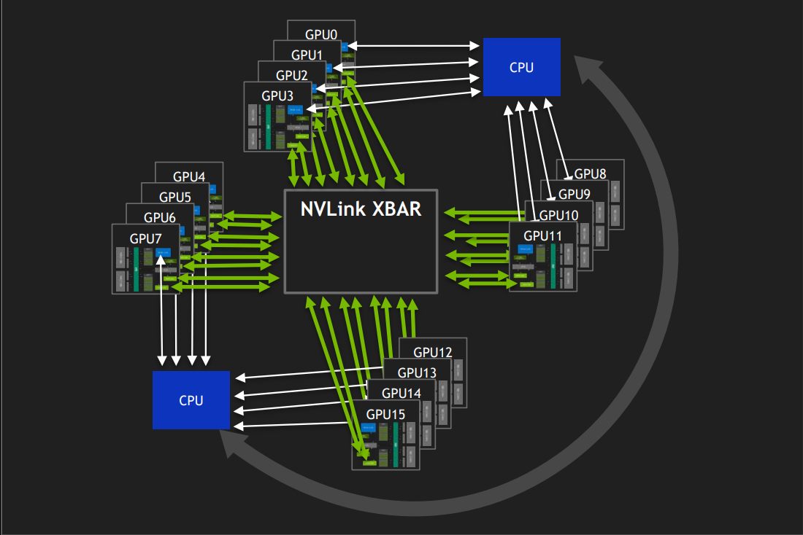

## 3.2 benefits

- 问题规模容量
    - 问题规模受限于所有GPU的总HBM2容量，而不是单个GPU的容量

- 强扩展性
    - 相比现有解决方案，NUMA效应大大降低
    - 聚合带宽(Aggregate)随GPU数量增加而增长
> 注释：NUMA（Non-Uniform Memory Access）效应 是指在多处理器或多核系统中，由于内存访问延迟不一致所引发的性能问题。
- 易用性
    - 为少量GPU编写的应用程序更容易移植
    - 丰富的资源 enables 快速实验

## 3.3 INTRODUCING NVSWITCH （推出NVswitch）
- Nvswitch是一种与GPU相关的XBAR桥接设备，不是通用网络设备。
- 包转换使多个GPU的流量看起来像是单个GPU的流量；
- XBAR is non-blocking；
- 基于SRAM的缓冲；
- NVLink IP模块和XBAR的设计/验证基础设施是从V100重用的

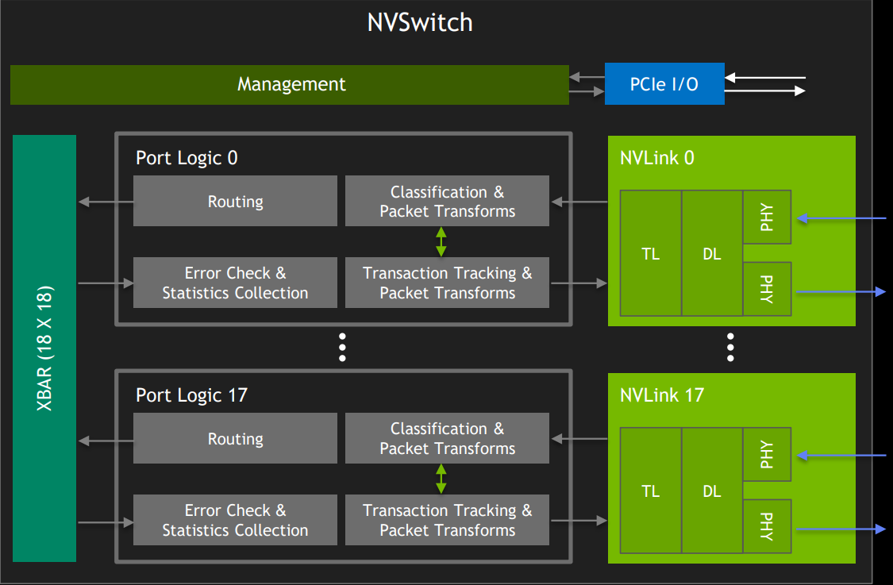

## 3.4 pysical shared memory
- 虚拟到物理地址的转换**在GPC（图形处理集群）中完成**
- NVLink数据包**携带物理地址**;
- NVSwitch 和 DGX-2 遵循相同的模型;

## 3.5 从 nvlink 直连到 nvswitch

**No NVSWitch**  
- 将GPU直接连接, 聚合NVLinks形成更高带宽的组
- 通过链接交错以防止资源占用
- 两个GPU之间的最大带宽受限于组的带宽

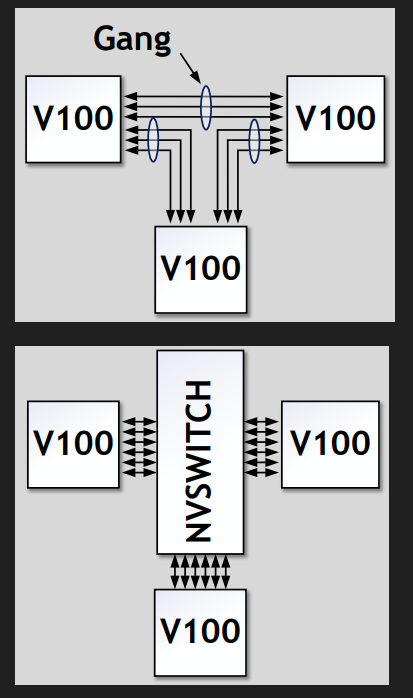

- 在所有链路上交错传输流量，并支持任意两块GPU之间的全带宽。
- 流向单一GPU的流量是无阻塞的，只要六条NVLink的聚合带宽不被超过。

|GPU 类型|	NVLink 链路数|	是否支持 NVSwitch 全互连|
|:---:|:---:|:---:|
|V100|	6	| 是（DGX-2）|
|A100|	12	| 是（DGX A100）|
|H100|	18	| 是（DGX H100）|

## 3.6 DGX 配置 Non-Blocking Building Block
将每个GPU的NVLink连接到六个交换机中的**每一个,不需要在不同的交换机平面之间进行路由**,每个交换机可用的**18个NVLink**中有八个用于连接到GPU. 每个交换机**有十个NVLink可用于本地组外的通信**（仅需八个即可支持全带宽）这是**DGX-GPU主板**的配置.

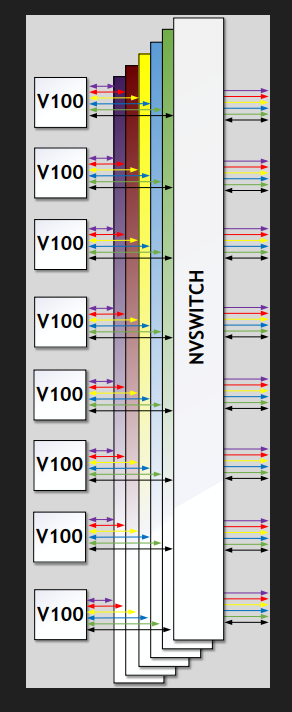

## 3.7  DGX-2 NVLIK Fabric

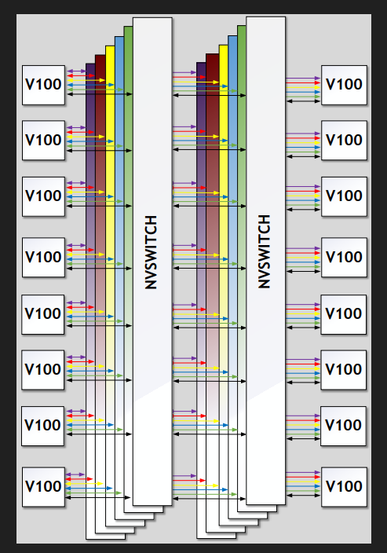

## 3.8 DGX-2 Pcie network

- Xeon插座通过QPI（快速通道互连）连接，但通过亲和力绑定（affinity-binding）可以将与GPU相关的流量保持在不使用QPI的状态。这意味着可以通过优化设置减少对QPI带宽的依赖，从而提高效率或降低延迟。 
- PCIe 架构中，网络接口控制器（NICs）连接到成对的图形处理器（GPUs），以支持通过 InfiniBand (IB) 网络的 GPUDirect 技术实现远程直接内存访问（RDMA）。这种配置优化了 GPU 之间的数据传输性能和效率。**IB 单向 100G**.
- NVSwitch的配置和控制是通过在CPU上运行的**驱动程序进程**来完成的。

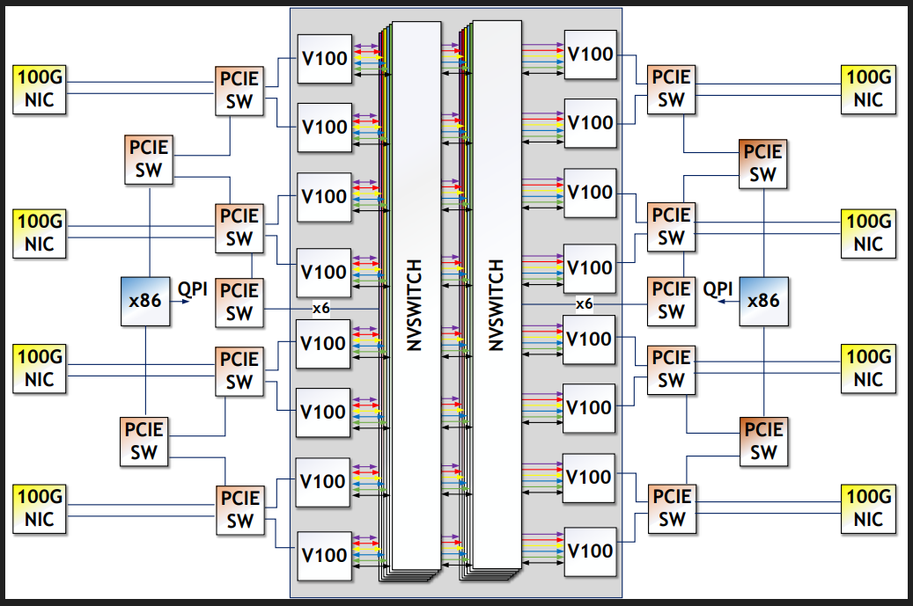

## 3.9 GPUS + NVSwitch complex
- 两块GPU主板，**每块主板**配备八个V100 GPU和**六个NVSwitch**，共12个NVSwitch;
- 两张Plane Cards**各自携带24条NVLinks**;
- 在所有NVLinks上不使用重复器或redrivers,节省电路板空间和功率；

> 疑问：为什么一个Plane Cards 携带24条NVLinks呢？
> 答：我们希望使任意两个 GPU（无论是否在同一 Plane Card）通信时仅需 1 跳（1-hop）, **V100上每个GPU有6个NVlink端口**， 8个GPU = 8x6 = 48 条 nvlink, 为确保两个 Plane Card 间通信无阻塞，互连带宽需 ≥ 单个 Plane Card 的总带宽（即 ≥ 48 条 NVLink 等效带宽），因此 每个 Plane Card 需提供 24 条 NVLink(DGX-2 的 跨卡链路带宽 按 单卡 GPU 总带宽的**50%**设计, 任一 GPU 的通信对象有 50% 概率在同卡，50% 概率在异卡).

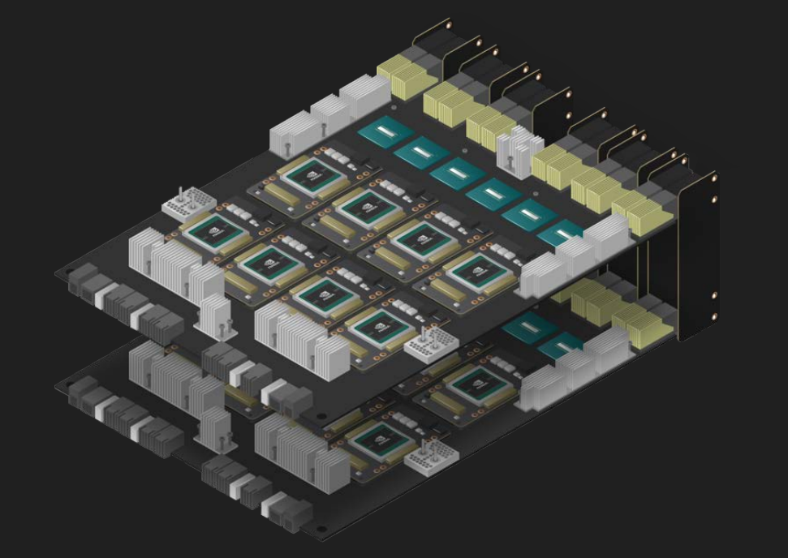
*安装原理图*

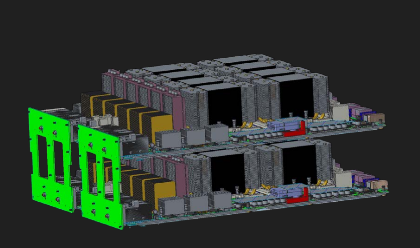
*实际连接图*

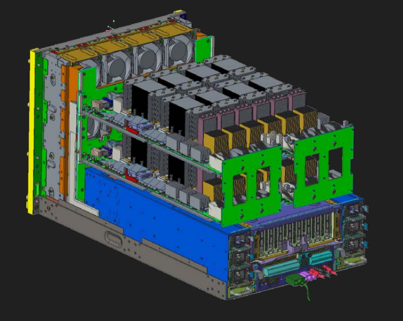
*冷却完整图*

# 4 DGX A100
## 4.1 原理图解
- [DGX-A100](https://images.nvidia.com/aem-dam/Solutions/Data-Center/nvidia-dgx-a100-datasheet.pdf)
- [DGx-A100 User Guide](https://docs.nvidia.com/dgx/dgxa100-user-guide/introduction-to-dgxa100.html)
- [DGx-A100 User Guide PDF](https://docs.nvidia.com/dgx/dgxa100-user-guide/dgxa100-user-guide.pdf)

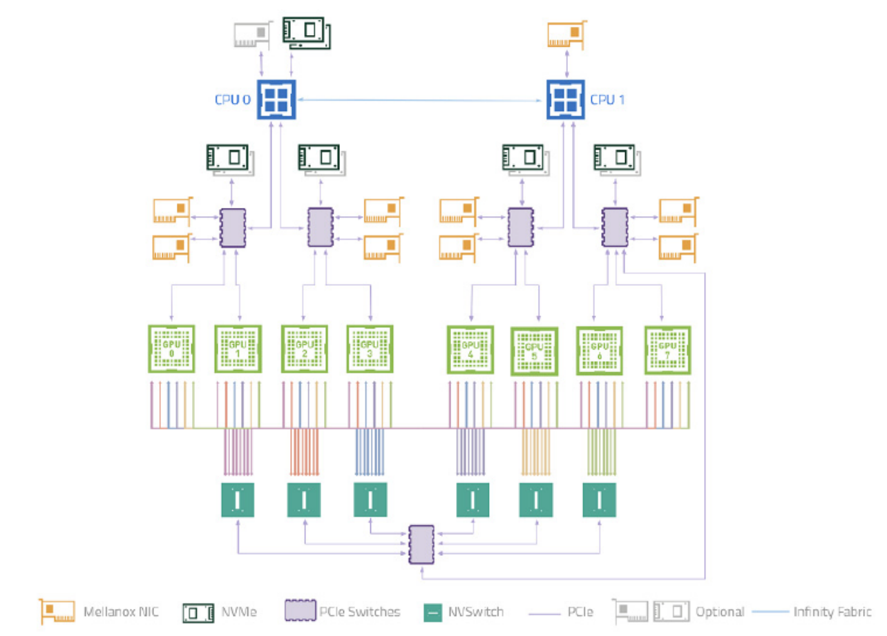

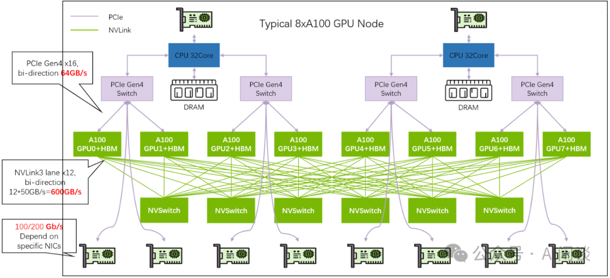

## 4.2 相关硬件

**Mellanox NIC**  
Mellanox NIC 是 Mellanox Technologies 公司生产的一种高性能网络接口卡（**Network Interface Card**），用于实现服务器与外部网络(InfiniBand/Ethernet以太网)之间的高速通信(分布走RDMA/TCP-IP协议)。

**NVMe**  
Non-Volatile Memory express (NVMe: 非易失性存储器) 是一种专为固态硬盘（SSD）设计的**高速存储协议和接口标准**。 

NVME 专为使用**PCIe(Peripheral Component Interconnect Express)外围组件互连高速通道接口**的非易失性存储设备(如 SSD)而设计。

**Bandwidth 瓶颈 ：PCIE Switch ？？？** 
- PCIe 是一种高速串行计算机扩展总线标准，广泛用于连接 CPU、GPU、SSD、网卡等高速外设；
- PCIe Switch 是一个中间路由设备，允许将一个 PCIe 接口扩展为多个接口，实现多个设备与主机之间的通信；
- 它类似于网络交换机，但专为 PCIe 协议设计;
- 多个NVSwitch 一方面直接相连，另一方面可连到一个PCIe Switch 上，这个switch 可以和常规pcie switch 连接，这样CPU/外设可以访问任意GPU 显存，打破数据孤岛.

数据经过PCIe Switch 必然会走PCIe 协议，这**确实会限制带宽**， 但DGX A100 通过架构优化将影响降到最低。

> 传统路径：GPU显存 → PCIe → CPU内存（复制）→ PCIe → 网卡 → 网络 → 远程网卡 → PCIe → CPU内存（复制）→ PCIe → 远程GPU显存
> GPUDirect Storage (GDS): 存储 → PCIe Switch → NVSwitch → GPU 显存，**绕过 CPU 复制**;
> GPUDirect RDMA: 网卡（InfiniBand）→ PCIe Switch → NVSwitch → GPU，实现网络数据直接入显存;
> GPUDirect RDMA: GPU显存 → PCIe（直接DMA）→ 网卡 → 网络 → 远程网卡 → PCIe（直接DMA）→ 远程GPU显存

# 5 DGX H100
- [DGX H100](https://resources.nvidia.com/en-us-dgx-systems/ai-enterprise-dgx?xs=489753)

- [DGX H100 User Guide](https://docs.nvidia.com/dgx/dgxh100-user-guide/introduction-to-dgxh100.html)

- [DGX H100 USer Guide PDF](https://docs.nvidia.com/dgx/dgxh100-user-guide/dgxh100-user-guide.pdf)

- ConnectX-7是NVIDIA Mellanox系列的下一代智能网卡，专为高性能计算和AI应用设计，其核心作用是提供超高速网络连接和低延迟数据传输;
- 支持 InfiniBand（NDR 400Gbps） 和 以太网（400GbE/200GbE/100GbE等），可根据需求灵活切换协议;

# 6 NVLink and NVSwitch bandwidth

**NVLink**  
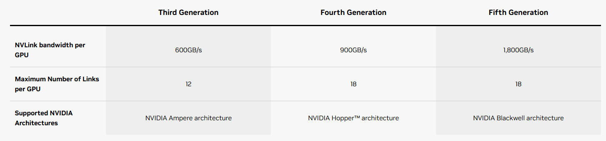

**NVSwitch**  
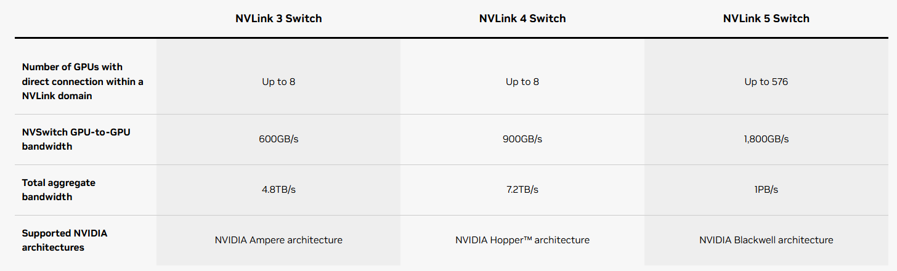

