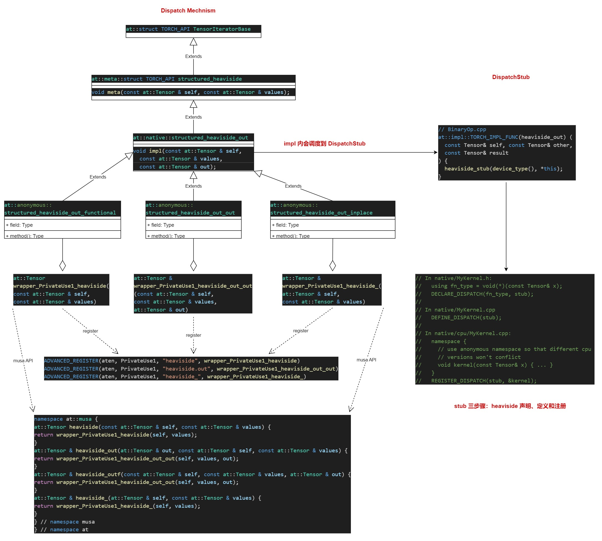

# natives_functions.yaml 关键字

- Tensr(a!) : 表示对应张量是mutable的，允许被就地修改;
- dispatch ：关键字用于指定某个操作（函数）在不同设备或后端上的具体实现。它允许为同一个操作针对不同的设备（如 CPU、CUDA）提供不同的底层实现；
- autogen 字段用于指定一个函数的自动生成实现。它告诉构建系统该函数的具体实现是由框架自动生成的，而不是手动编写的；
- variants 字段用于指定函数的变体类型。它定义了该函数是作为 普通函数（function） 还是 方法（method） 暴露给用户；
- structured 字段用于标记该函数是否是**结构化内核（Structured Kernel）**的一种。结构化内核是一种特殊的实现方式，通常基于 TensorIteratorBase 或其他统一抽象机制；
> 统一实现逻辑：使用结构化内核的函数会自动支持广播、标量扩展、类型提升等通用操作；
> 跨设备兼容性：无需为 CPU、CUDA 等不同设备重复编写相似逻辑，结构化内核会自动适配；
> 简化 dispatch 配置：与 dispatch 和 autogen/structured_delegate配合使用，减少手动配置条目；
> 提高可维护性：通过复用通用逻辑降低代码冗余，使函数调度更一致、更易维护。

- structured_delegate: acos.out 表示该函数是通过结构化内核机制实现的，并且其实际计算逻辑委托（delegate）给 acos.out 这个结构化函数来完成;
- structured_inherits 字段用于指定某个函数是否从另一个结构化函数(TensorIteratorBase 或其它一般函数)继承其实现逻辑；


# 1 全局展示


# 2 注册代码生成
两个重要的生成的代码：<br>
- torch_musa_codegen
- generated_cuda_compatible

## 2.1 torch_musa_codegen 下相关头文件
- /root/tiening.ma/torch_musa/torch_musa/share/torch_musa_codegen/ATen/ops/*.h
```shell
heaviside.h # python 接口直接调用at::heaviside.h 处
heaviside_compositeexplicitautogradnonfunctional_dispatch.h
heaviside_cpu_dispatch.h # RegisterCPU.cpp 中具体实现，此处声明
heaviside_meta.h  # meta 类继承自TensorIteratorBase
heaviside_meta_dispatch.h # RegisterMeta.cpp 里实现，这里只声明
heaviside_musa_dispatch.h # at::musa:: 命名空间直接获取对应函数的实现，定义在registMusa.cpp 最后
heaviside_native.h # native 类继承自meta 类, 供注册时使用
heaviside_ops.h # dispathch 的入口, 这里只声明， 实现由pytorch 源码统一的实现: Operators_*.cpp / OperatorEverything.cpp,
```

## 2.2 相关函数调用流程
- **step1: 先到at::heaviside** <br>
``` c++
#include <ATen/ops/heaviside_ops.h>

namespace at {

// aten::heaviside.out(Tensor self, Tensor values, *, Tensor(a!) out) -> Tensor(a!)
inline at::Tensor & heaviside_out(at::Tensor & out, const at::Tensor & self, const at::Tensor & values) {
    return at::_ops::heaviside_out::call(self, values, out);
}
// aten::heaviside.out(Tensor self, Tensor values, *, Tensor(a!) out) -> Tensor(a!)
inline at::Tensor & heaviside_outf(const at::Tensor & self, const at::Tensor & values, at::Tensor & out) {
    return at::_ops::heaviside_out::call(self, values, out);
}

// aten::heaviside(Tensor self, Tensor values) -> Tensor
inline at::Tensor heaviside(const at::Tensor & self, const at::Tensor & values) {
    return at::_ops::heaviside::call(self, values);
}

}
```

- **step2: 先到调度到at::_ops::heaviside::call** <br>
```c++
namespace at {
namespace _ops {

struct TORCH_API heaviside_out {
  using schema = at::Tensor & (const at::Tensor &, const at::Tensor &, at::Tensor &);
  using ptr_schema = schema*;
  // See Note [static constexpr char* members for windows NVCC]
  STATIC_CONSTEXPR_STR_INL_EXCEPT_WIN_CUDA(name, "aten::heaviside")
  STATIC_CONSTEXPR_STR_INL_EXCEPT_WIN_CUDA(overload_name, "out")
  STATIC_CONSTEXPR_STR_INL_EXCEPT_WIN_CUDA(schema_str, "heaviside.out(Tensor self, Tensor values, *, Tensor(a!) out) -> Tensor(a!)")
  static at::Tensor & call(const at::Tensor & self, const at::Tensor & values, at::Tensor & out);
  static at::Tensor & redispatch(c10::DispatchKeySet dispatchKeySet, const at::Tensor & self, const at::Tensor & values, at::Tensor & out);
};

struct TORCH_API heaviside {
  using schema = at::Tensor (const at::Tensor &, const at::Tensor &);
  using ptr_schema = schema*;
  // See Note [static constexpr char* members for windows NVCC]
  STATIC_CONSTEXPR_STR_INL_EXCEPT_WIN_CUDA(name, "aten::heaviside")
  STATIC_CONSTEXPR_STR_INL_EXCEPT_WIN_CUDA(overload_name, "")
  STATIC_CONSTEXPR_STR_INL_EXCEPT_WIN_CUDA(schema_str, "heaviside(Tensor self, Tensor values) -> Tensor")
  static at::Tensor call(const at::Tensor & self, const at::Tensor & values);
  static at::Tensor redispatch(c10::DispatchKeySet dispatchKeySet, const at::Tensor & self, const at::Tensor & values);
};

struct TORCH_API heaviside_ {
  using schema = at::Tensor & (at::Tensor &, const at::Tensor &);
  using ptr_schema = schema*;
  // See Note [static constexpr char* members for windows NVCC]
  STATIC_CONSTEXPR_STR_INL_EXCEPT_WIN_CUDA(name, "aten::heaviside_")
  STATIC_CONSTEXPR_STR_INL_EXCEPT_WIN_CUDA(overload_name, "")
  STATIC_CONSTEXPR_STR_INL_EXCEPT_WIN_CUDA(schema_str, "heaviside_(Tensor(a!) self, Tensor values) -> Tensor(a!)")
  static at::Tensor & call(at::Tensor & self, const at::Tensor & values);
  static at::Tensor & redispatch(c10::DispatchKeySet dispatchKeySet, at::Tensor & self, const at::Tensor & values);
};

}} // namespace at::_ops

```
**问题在于call在哪里实现的呢？？？** <br>
> 实现走的是pytorch 源码统一的实现，在Operators_*.cpp 中，同时在OperatorEverything.cpp 中肯定可以找到.

```c++
// aten::heaviside(Tensor self, Tensor values) -> Tensor
static C10_NOINLINE c10::TypedOperatorHandle<heaviside::schema> create_heaviside_typed_handle() {
  return c10::Dispatcher::singleton()
      .findSchemaOrThrow(heaviside::name, heaviside::overload_name)
      .typed<heaviside::schema>();
}

// aten::heaviside(Tensor self, Tensor values) -> Tensor
at::Tensor heaviside::call(const at::Tensor & self, const at::Tensor & values) {

    static auto op = create_heaviside_typed_handle();
    return op.call(self, values);
}
```

- **step3: 分发到对应的函数中** <br>
```c++
at::Tensor wrapper_PrivateUse1_heaviside(const at::Tensor & self, const at::Tensor & values) {
  // No device check
structured_heaviside_out_functional op;
op.meta(self, values);
op.impl(self, values, op.outputs_[0]);
return std::move(op.outputs_[0]);
}
```

- **step4: 在 op.impl 有宏定义**
```c++
TORCH_IMPL_FUNC(heaviside_out) (
  const Tensor& self, const Tensor& other, const Tensor& result
) {
  heaviside_stub(device_type(), *this);
}
```

- **step5: heaviside_stub**

heaviside_stub 由宏声明、定义、并注册相关函数，DispatchStub 类 的 operator() 函数里用get_call_ptr 调用具体的函数指针。

```c++
  template <typename... ArgTypes>
  rT operator()(c10::DeviceType device_type, ArgTypes&&... args) {
    FnPtr call_ptr = get_call_ptr(device_type);
    return (*call_ptr)(std::forward<ArgTypes>(args)...);
  }
```

# 3 DispatchStub 和 Dispacher 机制的关系

**Dispacher 注册的是上层的算子，底层会调度到DispatchStub 里的具体实现。**

> 综上所述，我们应该由两个层级的函数注册： 1. Stub 的注册； 2. Dispacher 的注册。

# 4. 算子注册

注册的统一入口：

- torch_musa/torch_musa/share/torch_musa_codegen/ATen/RegisterMUSA.cpp


## 3.1 结构化算子的注册

- **DispatchStub 注册发生在每个函数实现的最后**

```c++
// **/torch_musa/torch_musa/share/generated_cuda_compatible/aten/src/ATen/native/musa/StepKernel.mu
#define REGISTER_DISPATCH(name, fn) REGISTER_MUSA_DISPATCH(name, fn)

REGISTER_DISPATCH(heaviside_stub, &heaviside_kernel_cuda);

```

- **Dispacher 注册发生在RegisterMUSA.cpp 内**

```c++
#include <ATen/ops/heaviside_musa_dispatch.h>
#include <ATen/ops/heaviside_native.h>

namespace at {
namespace {

struct structured_heaviside_out_functional final : public at::native::structured_heaviside_out {
    void set_output_strided(
        int64_t output_idx, IntArrayRef sizes, IntArrayRef strides,
        TensorOptions options, DimnameList names
    ) override {
        auto current_device = guard_.current_device();
        if (C10_UNLIKELY(current_device.has_value())) {
          TORCH_INTERNAL_ASSERT(*current_device == options.device(),
            "structured kernels don't support multi-device outputs");
        } else {
          guard_.reset_device(options.device());
        }
        outputs_[output_idx] = create_out(sizes, strides, options);
        if (!names.empty()) {
          namedinference::propagate_names(outputs_[output_idx], names);
        }
        // super must happen after, so that downstream can use maybe_get_output
        // to retrieve the output
        at::native::structured_heaviside_out::set_output_raw_strided(output_idx, sizes, strides, options, names);
    }
    void set_output_raw_strided(
        int64_t output_idx, IntArrayRef sizes, IntArrayRef strides,
        TensorOptions options, DimnameList names
    ) override {
        auto current_device = guard_.current_device();
        if (C10_UNLIKELY(current_device.has_value())) {
          TORCH_INTERNAL_ASSERT(*current_device == options.device(),
            "structured kernels don't support multi-device outputs");
        } else {
          guard_.reset_device(options.device());
        }
        outputs_[output_idx] = create_out(sizes, strides, options);
        if (!names.empty()) {
          namedinference::propagate_names(outputs_[output_idx], names);
        }
        // super must happen after, so that downstream can use maybe_get_output
        // to retrieve the output
        at::native::structured_heaviside_out::set_output_raw_strided(output_idx, sizes, strides, options, names);
    }
    const Tensor& maybe_get_output(int64_t output_idx) override {
      return outputs_[output_idx];
    }
    std::array<Tensor, 1> outputs_;
    c10::musa::OptionalMUSAGuard guard_;
};
at::Tensor wrapper_PrivateUse1_heaviside(const at::Tensor & self, const at::Tensor & values) {
  // No device check
structured_heaviside_out_functional op;
op.meta(self, values);
op.impl(self, values, op.outputs_[0]);
return std::move(op.outputs_[0]);
}
struct structured_heaviside_out_out final : public at::native::structured_heaviside_out {
    structured_heaviside_out_out(Tensor& out0) : outputs_{ std::ref(out0) } {}
    void set_output_strided(
        int64_t output_idx, IntArrayRef sizes, IntArrayRef strides,
        TensorOptions options, DimnameList names
    ) override {
        auto current_device = guard_.current_device();
        if (C10_UNLIKELY(current_device.has_value())) {
          TORCH_INTERNAL_ASSERT(*current_device == options.device(),
            "structured kernels don't support multi-device outputs");
        } else {
          guard_.reset_device(options.device());
        }
        const auto& out = outputs_[output_idx].get();
        resize_out(out, sizes, strides, options);
        auto maybe_proxy = maybe_create_proxy(out, sizes, strides, options);
        if (C10_UNLIKELY(maybe_proxy.has_value())) {
            proxy_outputs_[output_idx] = std::move(maybe_proxy).value();
        }
        if (!names.empty()) {
          namedinference::propagate_names(outputs_[output_idx], names);
        }
        // super must happen after, so that downstream can use maybe_get_output
        // to retrieve the output
        at::native::structured_heaviside_out::set_output_raw_strided(output_idx, sizes, strides, options, names);
    }
    void set_output_raw_strided(
        int64_t output_idx, IntArrayRef sizes, IntArrayRef strides,
        TensorOptions options, DimnameList names
    ) override {
        auto current_device = guard_.current_device();
        if (C10_UNLIKELY(current_device.has_value())) {
          TORCH_INTERNAL_ASSERT(*current_device == options.device(),
            "structured kernels don't support multi-device outputs");
        } else {
          guard_.reset_device(options.device());
        }
        const auto& out = outputs_[output_idx].get();
        resize_out(out, sizes, strides, options);
        if (!names.empty()) {
          namedinference::propagate_names(outputs_[output_idx], names);
        }
        // super must happen after, so that downstream can use maybe_get_output
        // to retrieve the output
        at::native::structured_heaviside_out::set_output_raw_strided(output_idx, sizes, strides, options, names);
    }
    const Tensor& maybe_get_output(int64_t output_idx) override {
      return proxy_outputs_[output_idx].has_value() ? *proxy_outputs_[output_idx] : outputs_[output_idx].get();
    }
    std::array<std::reference_wrapper<Tensor>, 1> outputs_;
    std::array<c10::optional<Tensor>, 1> proxy_outputs_;
    c10::musa::OptionalMUSAGuard guard_;
};
at::Tensor & wrapper_PrivateUse1_heaviside_out_out(const at::Tensor & self, const at::Tensor & values, at::Tensor & out) {
  // No device check
structured_heaviside_out_out op(out);
op.meta(self, values);
op.impl(self, values, op.maybe_get_output(0));
if (op.proxy_outputs_[0].has_value()) op.outputs_[0].get().copy_(*op.proxy_outputs_[0]);
return out;
}
struct structured_heaviside_out_inplace final : public at::native::structured_heaviside_out {
    structured_heaviside_out_inplace(Tensor& self) : outputs_{std::ref(self)} {}
    void set_output_strided(
        int64_t output_idx, IntArrayRef sizes, IntArrayRef strides,
        TensorOptions options, DimnameList names
    ) override {
        auto current_device = guard_.current_device();
        if (C10_UNLIKELY(current_device.has_value())) {
          TORCH_INTERNAL_ASSERT(*current_device == options.device(),
            "structured kernels don't support multi-device outputs");
        } else {
          guard_.reset_device(options.device());
        }
        const auto& out = outputs_[output_idx].get();
        check_inplace(out, sizes, options);
        auto maybe_proxy = maybe_create_proxy(out, sizes, strides, options);
        if (C10_UNLIKELY(maybe_proxy.has_value())) {
            proxy_outputs_[output_idx] = std::move(maybe_proxy).value();
        }
        if (!names.empty()) {
          namedinference::propagate_names(outputs_[output_idx], names);
        }
        // super must happen after, so that downstream can use maybe_get_output
        // to retrieve the output
        at::native::structured_heaviside_out::set_output_raw_strided(output_idx, sizes, strides, options, names);
    }
    void set_output_raw_strided(
        int64_t output_idx, IntArrayRef sizes, IntArrayRef strides,
        TensorOptions options, DimnameList names
    ) override {
        auto current_device = guard_.current_device();
        if (C10_UNLIKELY(current_device.has_value())) {
          TORCH_INTERNAL_ASSERT(*current_device == options.device(),
            "structured kernels don't support multi-device outputs");
        } else {
          guard_.reset_device(options.device());
        }
        const auto& out = outputs_[output_idx].get();
        check_inplace(out, sizes, options);
        if (!names.empty()) {
          namedinference::propagate_names(outputs_[output_idx], names);
        }
        // super must happen after, so that downstream can use maybe_get_output
        // to retrieve the output
        at::native::structured_heaviside_out::set_output_raw_strided(output_idx, sizes, strides, options, names);
    }
    const Tensor& maybe_get_output(int64_t output_idx) override {
      return proxy_outputs_[output_idx].has_value() ? *proxy_outputs_[output_idx] : outputs_[output_idx].get();
    }
    std::array<std::reference_wrapper<Tensor>, 1> outputs_;
    std::array<c10::optional<Tensor>, 1> proxy_outputs_;
    c10::musa::OptionalMUSAGuard guard_;
};
at::Tensor & wrapper_PrivateUse1_heaviside_(at::Tensor & self, const at::Tensor & values) {
  // No device check
structured_heaviside_out_inplace op(self);
op.meta(self, values);
op.impl(self, values, op.outputs_[0]);
if (op.proxy_outputs_[0].has_value()) op.outputs_[0].get().copy_(*op.proxy_outputs_[0]);
return self;
}


ADVANCED_REGISTER(aten, PrivateUse1, "heaviside", wrapper_PrivateUse1_heaviside)
ADVANCED_REGISTER(aten, PrivateUse1, "heaviside.out", wrapper_PrivateUse1_heaviside_out_out)
ADVANCED_REGISTER(aten, PrivateUse1, "heaviside_", wrapper_PrivateUse1_heaviside_)
} // anonymous namespace
} // namespace at

```

## 3.1 非结构化算子的注册

- yaml 里的声明

```yaml
- func: _fused_sdp_choice
  dispatch:
    PrivateUse1: _fused_sdp_choice_musa
```
- 同样要进行DispatchStub 的注册

```c++
// */torch_musa/torch_musa/csrc/aten/ops/attention/mudnn/SDPBackendSelect.cpp
namespace native {

REGISTER_MUSA_DISPATCH(_fused_sdp_choice_stub, &musa::_fused_sdp_choice_musa);

} // namespace native
```

- RegisterMUSA.cpp 里的注册
```c++
// 先声明
namespace at {

// step1: 待注册函数实现
namespace {
  int64_t wrapper_PrivateUse1___fused_sdp_choice(const at::Tensor & query, const at::Tensor & key, const at::Tensor & value, const ::std::optional<at::Tensor> & attn_mask, double dropout_p, bool is_causal, ::std::optional<double> scale, bool enable_gqa) {
      // No device check
    // DeviceGuard omitted
    // _fused_sdp_choice_musa 是内部自己实现的函数
    return at::musa::_fused_sdp_choice_musa(query, key, value, attn_mask, dropout_p, is_causal, scale, enable_gqa);
  }
} // anonymous namespace


// step2: 注册
ADVANCED_REGISTER(aten, PrivateUse1, "_fused_sdp_choice", wrapper_PrivateUse1___fused_sdp_choice)


// step3 : 打包成统一对外函数
namespace musa {
  int64_t _fused_sdp_choice(const at::Tensor & query, const at::Tensor & key, const at::Tensor & value, const ::std::optional<at::Tensor> & attn_mask, double dropout_p, bool is_causal, ::std::optional<double> scale, bool enable_gqa) {
  return wrapper_PrivateUse1___fused_sdp_choice(query, key, value, attn_mask, dropout_p, is_causal, scale, enable_gqa);
}
} // namespace musa

} // namespace at
```

- at::musa::_fused_sdp_choice_musa 是内部自己实现的函数
```c++
// */torch_musa/torch_musa/csrc/aten/ops/attention/mudnn/SDPBackendSelect.cpp
namespace at {
namespace musa {

int64_t _fused_sdp_choice_musa(
    const Tensor& query,
    const Tensor& key,
    const Tensor& value,
    const std::optional<Tensor>& attn_mask,
    double dropout_p,
    bool is_causal,
    std::optional<double> scale,
    bool enable_gqa) {
  const sdp::sdp_params params{
      query, key, value, attn_mask, dropout_p, is_causal, enable_gqa};
  const auto backend = sdp::select_backend(params);
  if (backend == sdp::SDPBackend::error) {
    TORCH_CHECK(
        false,
        "No viable backend for scaled_dot_product_attention in musa",
        "This is likely due to turning off both the math kernel and the flash kernel.");
  }
  return static_cast<int64_t>(backend);
}

} // namespace musa

namespace native {

REGISTER_MUSA_DISPATCH(_fused_sdp_choice_stub, &musa::_fused_sdp_choice_musa);

} // namespace native
```

- 对应的头文件是codegen 生成的

```c++
// /root/tiening.ma/torch_musa/torch_musa/share/torch_musa_codegen/ATen/ops/_fused_sdp_choice_native.h
// @generated by gen_torch_musa.py from MusaNativeFunction.h

#include <ATen/ops/torch__fused_sdp_choice_native.h>

namespace at {
namespace musa {
TORCH_API int64_t _fused_sdp_choice_musa(const at::Tensor & query, const at::Tensor & key, const at::Tensor & value, const ::std::optional<at::Tensor> & attn_mask={}, double dropout_p=0.0, bool is_causal=false, ::std::optional<double> scale=::std::nullopt, bool enable_gqa=false);
} // namespace musa
} // namespace at
```
