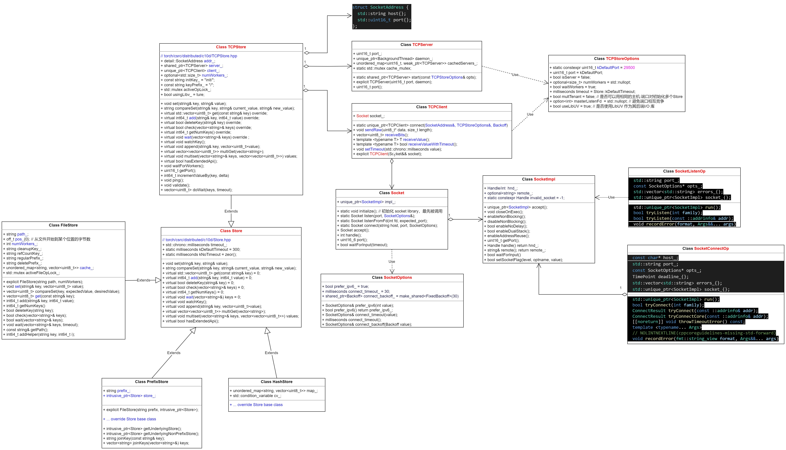

# 1 Store 概述
在 PyTorch 的分布式训练中，Store 和 PrefixStore 用于进程间的通信和协调。PrefixStore 是一个在基础 Store 上添加了前缀（prefix）的封装，目的是在多租户或多任务场景下**隔离不同组或任务**的键值存储。



# 2 TCP Store

在PyTorch分布式系统中，TCPStore主要用于进程间的通信和初始化分布式进程组。TCPStore作为分布式键值存储，允许进程之间共享信息，这在分布式训练中非常重要。

具体来说，在PyTorch分布式训练中，TCPStore可能用于设置和存储以下类型的数据：

1. 进程初始化信息：<br>
在分布式训练中，每个进程需要知道如何联系其他进程。TCPStore可以存储这些信息，如主进程的IP地址（MASTER_ADDR）和端口号（MASTER_PORT），以及参与训练的进程总数（world_size）和当前进程的等级（rank）。这些信息是初始化分布式进程组所必需的。
2. 模型参数和梯度：<br>
虽然TCPStore不是直接用于存储模型参数和梯度的（这些通常存储在GPU或其他设备的内存中），但在某些情况下，TCPStore可能用于在进程之间传递参数或梯度的更新信息。然而，在PyTorch的分布式数据并行（DDP）中，梯度的同步通常是通过更高效的通信机制（如AllReduce）来实现的。
3. 训练状态信息：<br>
TCPStore还可以用于存储训练过程中的状态信息，如当前迭代次数、学习率等。这些信息可以在进程之间共享，以确保所有进程都使用相同的训练设置。
4. 同步信号：<br>
在分布式训练中，进程之间需要同步以确保它们按照相同的步骤进行训练。TCPStore可以用于存储同步信号，以指示所有进程都已准备好进入下一个训练阶段。
5. 其他辅助信息：<br>
根据具体的应用场景，TCPStore还可以存储其他类型的辅助信息，如日志信息、调试信息等。这些信息有助于监控和调试分布式训练过程。

>需要注意的是，TCPStore只是PyTorch分布式系统中的一个组件，它与其他组件（如后端通>信机制、进程组等）一起工作，以实现高效的分布式训练。在使用TCPStore时，需要确保所有进程都能够访问它，并且需要仔细处理竞争条件和同步问题。

>此外，PyTorch还提供了其他初始化方法（如环境变量初始化、共享文件系统初始化等），这些方法可以根据具体的应用场景和需求来选择。在选择初始化方法时，需要考虑系统的可用性、可靠性和性能等因素。

# 3 FileStore

>**概念:** FileStore是一个基于文件系统的分布式存储实现，它使用文件来存储键值对。它允许在多个进程之间共享数据，而无需通过网络进行传输。<br>

>**特点:** FileStore的优点是简单且易于实现，因为它依赖于现有的文件系统。然而，它的性能可能受到文件系统I/O性能的限制。它适用于对性能要求不高的分布式应用场景。

>**用法:** 在使用FileStore时，需要指定一个文件路径来存储键值对。多个进程可以访问同一个文件路径来共享数据。

# 4 prefix store
&nbsp;&nbsp;&nbsp;&nbsp;&nbsp;&nbsp;&nbsp;&nbsp;当通过 torch.distributed.PrefixStore(prefix, store) 创建实例时，所有通过该 PrefixStore 操作的键（如 set, get）会自动在原始键前添加 prefix。

>**例如:** 使用 PrefixStore("worker1", store) 后，调用 store.set("key", value) 实际上会在底层 store 中存储键为 "worker1/key" 的值。

```python
import torch.distributed as dist

# 初始化主 Store
backend_store = dist.TCPStore("127.0.0.1", 1234, world_size=4, is_master=True)

# 创建带前缀的 PrefixStore
prefix = "task_a"
task_store = dist.PrefixStore(prefix, backend_store)

# 写入数据（实际键为 "task_a/data"）
task_store.set("data", torch.tensor([1, 2, 3]))

# 从底层 Store 读取（需知道前缀）
value = backend_store.get("task_a/data")
```
