# 1 PyTorch SymmetricMemory: Harnessing(利用) NVLink Programmability(可编程性) with Ease

我们在PyTorch中引入了SymmetricMemory，以便用户能够轻松利用NVLink的可编程性。SymmetricMemory允许人们通过tensor1.copy_(tensor2)轻松实现基于复制引擎(copy engine)的**点对点（P2P）复制**，并且可以在CUDA或Triton中编写自定义的NVLink/NVLS集合操作或融合计算/通信内核。<br>

# 2 Backgroud
随着分布式并行化技术的快速发展，我们观察到一种趋势，即NVLink带宽正以越来越明确的方式被利用(harnessed)。最初，在一维并行化中，NVLink带宽仅(exclusively)由NCCL的轨道优化PxN集合使用。后来，在二维及以上的并行化中，实践者开始明确地将NVLink带宽分配给特定流量（例如，张量并行化）。接着，创新的**块级计算/通信**重叠技术开始使用复制引擎来驱动P2P流量，以最小化竞争。现在，我们看到一些技术，其中**NVLink通信直接从“计算”内核发出**。

> 注释：PXN 集合：P - 参与通信的GPU 数量；N - 每个GPU发送或接收的数据块数量（segments）， 常用于Allreduce 中；

我们相信这一趋势是由在设计并行性解决方案时对硬件日益增长的认识所推动的。这种多样性的增加表明，需要比当今高级集体API所提供的**更细粒度的原语(primitives)**。就像Triton允许普通用户根据自己的需求修改矩阵乘法（融合、量化等），我们**希望SymmetricMemory能够使普通用户根据自己的要求修改NVLink通信算法**，无论是实现替代的集体算法（一次性allreduce）、使用不同的量化方法（随机舍入），还是将集体操作与其他内核融合（matmul overlap with all-gather）。<br>

# 3 Relevant Hardware Capabilities（相关的硬件能力）

## 3.1 通过SM或复制引擎(copy engine)经NVLink进行对等内存访问

NVLinks 实质上是 XBAR 之间的桥梁。它们允许一个 GPU 通过流式多处理器（SM）内存指令（例如加载/存储/原子操作/归约/多内存等）或复制引擎(copy engine)来访问另一个连接的 GPU 的 HBM（高带宽内存）。这两种方法都使用**虚拟地址**来引用操作数。

> XBAR 控制器是 Crossbar Switch（交叉开关）的缩写，指的是GPU之间的互联交换矩阵, 它是NVLink 连接性的核心**硬件组件**，允许每个GPU直接访问其他GPU的内存；
> SymmetricMemory 利用了 XBAR + NVLink 的能力，使得：
> 1. GPU 可以通过 SM（流式多处理器）直接执行远程内存操作（如加载、归约等）
> 2. 通过复制引擎（Copy Engine）进行高效的 P2P 内存拷贝;
> 3. 所有这些操作都通过 XBAR 实现跨 GPU 数据传输;

> copy engine 是什么？
> copy-engine 是GPU中专用硬件单元，用于在**不占用SM资源情况下执行内存copy操作**, 常见操作：
> HCC (Host Channel Copy)：用于主机（CPU）和设备（GPU）之间的拷贝;
> P2P (Peer-to-Peer)：用于不同 GPU 之间的内存拷贝;
> Device to Device：同一 GPU 内部不同内存区域之间的拷贝；
> **SM 可直接驱动远程内存操作，通常不需要 copy-engine 参与，而是由 SM（流式多处理器）直接通过 NVLink/XBAR 操作远程 GPU 的 HBM.**

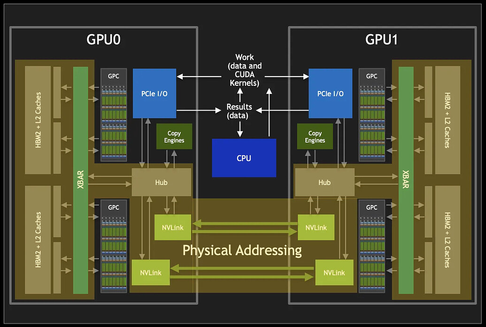
*Figure 1: Source: NVSWITCH AND DGX-2*

*上图中GPC（Graphics Processing Cluster，图形处理簇）是一组 Tiling Engine（分块引擎）、Raster Engine（光栅化引擎） 和多个 Streaming Multiprocessor（SM） 的集合*

CUDA驱动程序通过虚拟内存管理暴露此功能。GPU可以通过将相应的物理分配映射到其虚拟地址空间来访问远程内存。

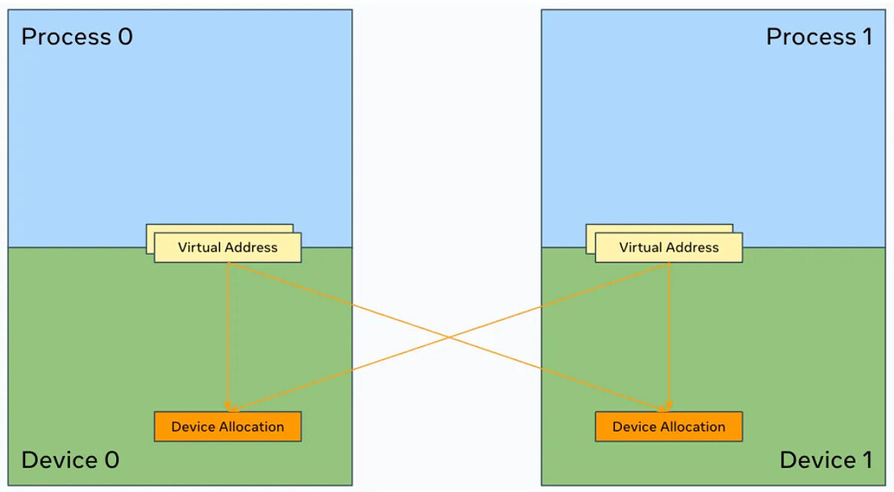
*Figure 2: Memory mapping for peer memory access over NVLink*

## 3.2 NVLS (Multicast and In-Switch Reduction)
自从NVSwitch V3以来，GPU可以通过在多播地址上发布(issuing)多内存(multimem)指令来启动多播(multicast)和交换机内缩减(in-switch reduction)。此功能允许以较少的NVLink流量执行广播和缩减(以及all-gather和all-reduce), 同时将reduction卸载到**switch**。

**multimem 的核心原理** <br>
多播（Multicast）可以减少通信流量的原因主要在于其一次发送、多点接收的特性。相比传统的逐点传输方式，多播在数据需要同时传输到多个节点时具有显著的带宽优势。

- 在没有多播的情况下，如果一个源设备需要将相同的数据发送给多个目标设备，它必须进行多次独立的点对点（P2P）传输。
- 每次传输都会占用相同的NVLink带宽资源，导致总带宽消耗与目标数量成正比。
- 使用多播后，源设备只需发送一次数据，该**数据会在交换机（如 NVSwitch）内部复制并转发给所有目标设备**。
- 总NVLink带宽消耗仅为单次传输的大小，**无论有多少个接收者**。
- 多播**减少了整体的NVLink流量**，从而降低了链路拥塞的可能性;
- 多播功能由 NVSwitch V3 及以上版本支持，其内部硬件可以在不增加源端负载的前提下完成数据复制;
- 数据在switch芯片内部被复制，无需源设备参与多次发送过程;
- SymmetricMemory 会用到多播（Multicast）技术，尤其是在支持 NVSwitch V3+ 的硬件上，它通过 NVLS（NVLink Multicast and In-Switch Reduction） 功能来实现高效的广播、规约等集合通信操作；
- NVSwitch v3 首次出现在H100 GPU 中.

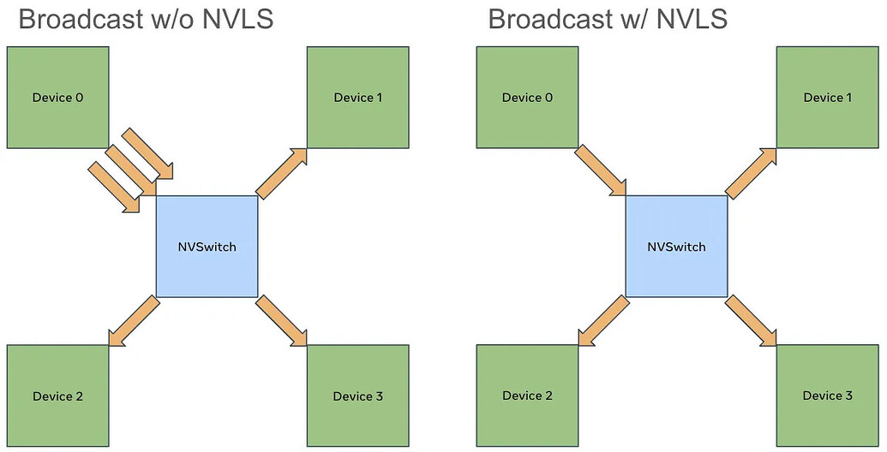
*Figure 3: Broadcast with NVLS*

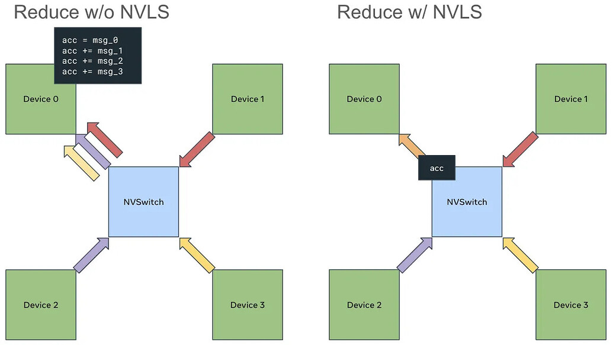
*FIgure 4: Reduce with NVLS*

CUDA驱动程序通过多播机制(multicast mechanism)暴露此功能。GPU可以通过将**多个设备**的物理分配绑定到**一个多播对象上**来**创建多播地址**，并将其映射到其虚拟内存地址空间。

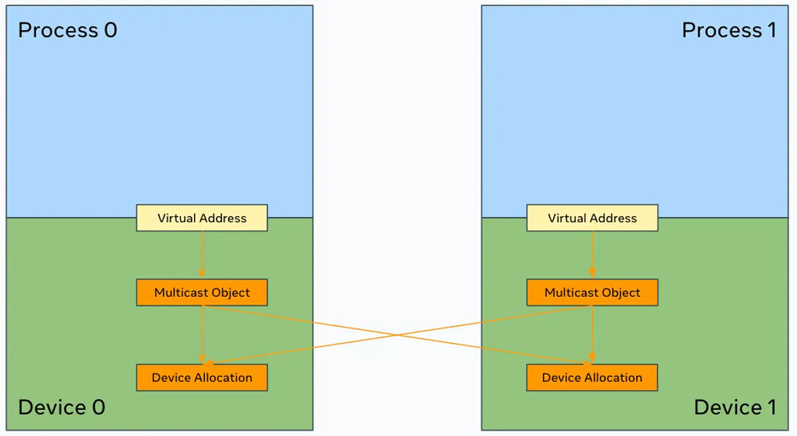
*Figure 5: Memory mapping for NVLS*

# 4 SymmetricMemory
配置上述硬件功能所需的内存映射需要一些努力和不太常见的知识。虽然一些高级用户可以完成(navigate)设置过程，但这对于更多工程师来说成为了一个障碍(hurdle)，使他们难以实验和实现自己的想法。

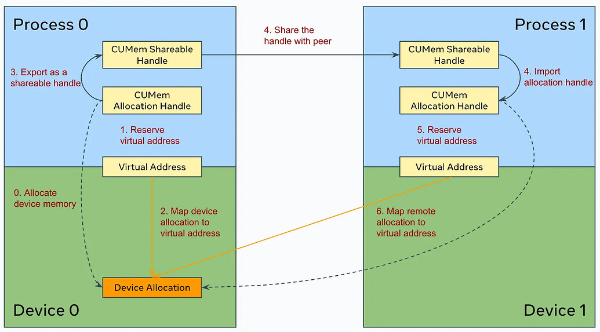
*Figure 6: Configuration process for peer memory access over NVLink*

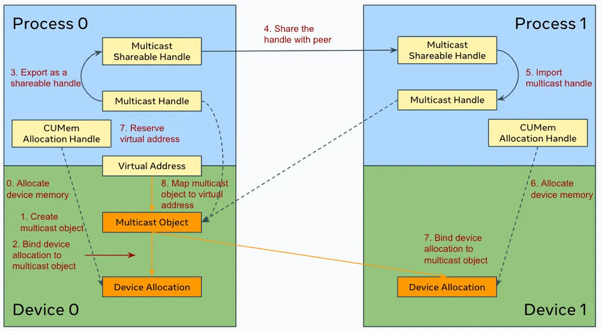
*Figure 7: Configuration process for NVLS*

因此，我们引入了SymmetricMemory。从语义上讲，它允许将来自不同设备的分配组合成一个对称内存分配(symmetric memory allocation)。通过使用对称内存句柄(symmetric memory handle)，GPU可以经由其虚拟内存地址或多播地址访问相关的(associated)对等(peer)分配。

SymmetricMemory 将设置过程简化为两个步骤。

- step1: 首先，用户通过 symm_mem.empty() 分配一个张量。它的语义与 torch.empty() 完全相同，但使用了一个特殊的allocator。

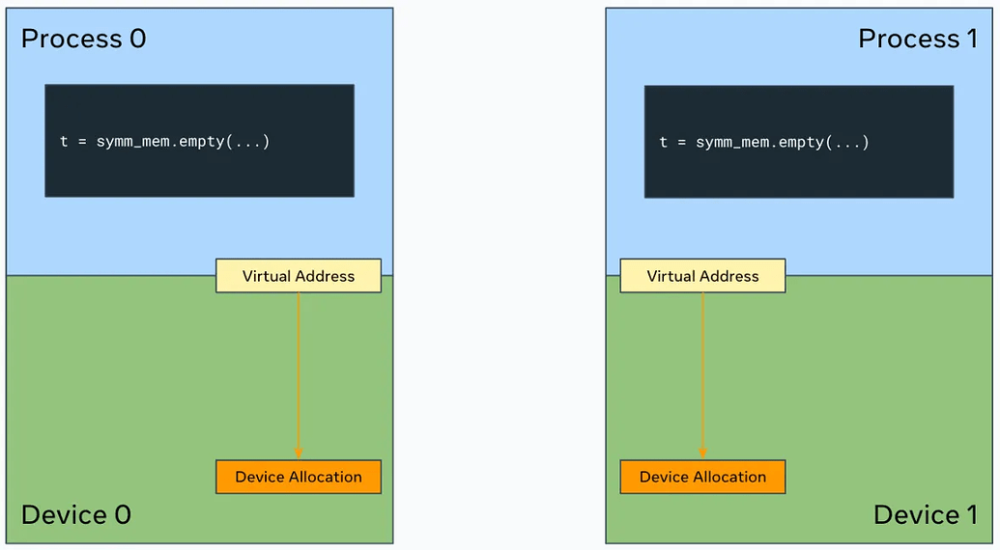
*Figure 8: symm_mem.empty()*

- step2: 然后，用户以集合方式**在张量上**调用 symm_mem.rendezvous(tensor)，以建立对称内存分配。此操作会在内部执行所需的句柄交换和**内存映射**。

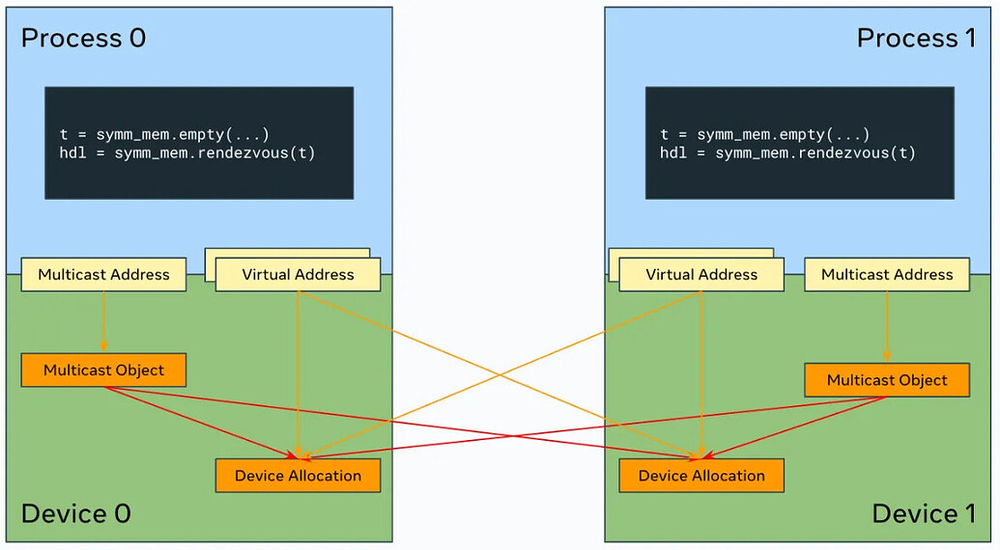
*Figure 9: symm_mem.rendezvous()*

远程内存访问如果没有同步机制将没有实际作用。SymmetricMemory 提供了与 CUDA-graph 兼容的同步原语(synchronization primitives)，这些同步原语(synchronization primitives)可以在每个对称内存分配所附带的信号垫（signal pad）上操作。

*信号垫通常附加在每个对称内存分配（symmetric memory allocation）上，作为管理访问顺序和状态的标记*

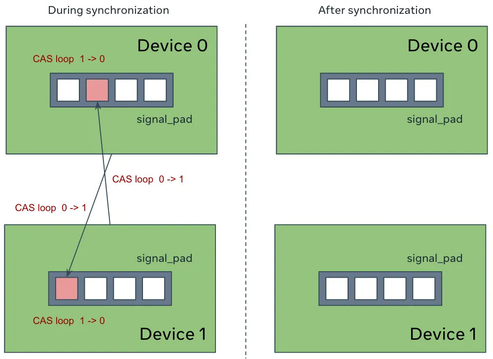
*Figure 10: CUDA graph-friendly synchronization primitives that resets the signal pad to 0 upon successful synchronization*

> using symmetric memory

```python
import os
import torch.distributed as dist
import torch.distributed._symmetric_memory as symm_mem
import torch

rank = int(os.environ["RANK"])
world_size = int(os.environ["WORLD_SIZE"])
torch.cuda.set_device(f"cuda:{rank}")
dist.init_process_group("nccl")

prev_rank = (rank - 1) % world_size
next_rank = (rank + 1) % world_size

# Allocate a tensor
t = symm_mem.empty(4096, device="cuda")

# Establish symmetric memory and obtain the handle
hdl = symm_mem.rendezvous(t, dist.group.WORLD)
peer_buf = hdl.get_buffer(next_rank, t.shape, t.dtype)

# Pull
t.fill_(rank)
hdl.barrier(channel=0)
pulled = torch.empty_like(t)
pulled.copy_(peer_buf)
hdl.barrier(channel=0)
assert pulled.eq(next_rank).all()

# Push
hdl.barrier(channel=0)
to_push = torch.full_like(t, rank)
peer_buf.copy_(to_push)
hdl.barrier(channel=0)
assert t.eq(prev_rank).all()

# Direct
t.fill_(rank)
hdl.barrier(channel=0)
torch.add(peer_buf, rank, out=peer_buf)
hdl.barrier(channel=0)
assert t.eq(rank + prev_rank).all()

# Raw pointers for CUDA/Triton kernels
hdl.buffer_ptrs
hdl.multicast_ptr
hdl.signal_pad_ptrs
```

# 5 Application Examples and Recipes
我们一直在使用SymmetricMemory进行内部测试，以验证其灵活性和表达能力，具体方式是通过开发利用它的PT-D（pytorch-distribute）功能并为其创建应用方案（配方）。在本节中，我们将简要介绍一些示例。

## 5.1 Decomposition-Based Async-TP (with Host APIs Only)
我们基于 SymmetricMemory 主机 API 实现了分解式的异步传输-处理（async-TP）。该实现采用了 [LoopedCollectiveEinsum](https://dl.acm.org/doi/abs/10.1145/3567955.3567959) 论文中提出的算法，并利用了 [xformers](https://github.com/facebookresearch/xformers) 实现中的关键 CUDA 优化技术。此实现对于中等和大型问题规模达到了接近最优的性能。目前，该实现以实验状态集成在 PyTorch 中。

详细请参数看[Distributed w/TorchTitan](https://discuss.pytorch.org/t/distributed-w-torchtitan-introducing-async-tensor-parallelism-in-pytorch/209487/4)

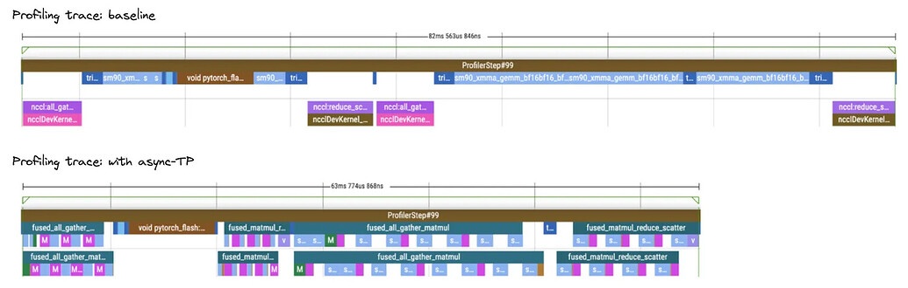
*Figure 11: TorchTitan Llama3 70B profiling trace comparison between the baseline and decomposition-based async-TP*

## 5.2 单一计算内核异步传输技术（使用CUTLASS库）
基于分解的(decomposition-based)异步TP方法在**问题规模较小时会受到GPU调度开销的影响**。为了解决这一问题，我们实现了一个基于CUTLASS且考虑通信特性的矩阵乘法。该方法并非对矩阵乘法进行分解，而是按照全局收集（all-gather）块就绪的顺序对块进行光栅化处理。此实现利用了SymmetricMemory主机API以高效完成点对点（P2P）数据拷贝，并使用stream_write_value32 API实现高效的信号传递。<br>

For more details, see the [PR](https://github.com/pytorch/pytorch/pull/139227)


*Figure 12: Profiling trace of single compute kernel async-TP w/ CUTLASS*

## 5.3 Single Compute Kernel Async-TP (w/ Triton)
作为一次探索，我们还在Triton中实现了通信感知的矩阵乘法，并取得了良好的结果。此实现为用户在调优和尾声融合（epilogue fusion）方面提供了更大的灵活性。我们已将其作为教程发布在GitHub上。

For more details, see [the recipe](https://github.com/yifuwang/symm-mem-recipes?tab=readme-ov-file#triton_all_gather_matmulpy)

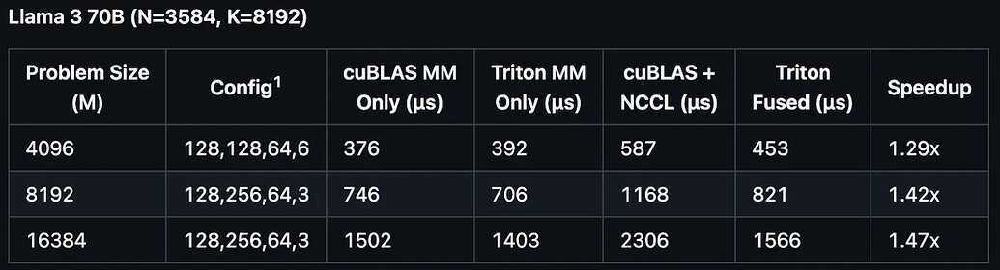
*Figure 13: The Triton implementation leverages both the overlapping technique and Triton’s better performance on certain problem sizes*

## 5.4 Low-Latency/NVLS Collectives (with CUDA and Triton)
我们在NVLink域内实现了一组用于**分布式推理**的低延迟集合操作（例如，one_shot_all_reduce、two_shot_all_reduce），以及当NVSwitch V3+可用时通常表现更优的NVLS集合操作（例如，multimem_all_reduce、multimem_all_gather）。这些操作接收对称内存张量作为输入，底层内核直接在缓冲区/信号填充指针上操作。这些操作以实验状态在PyTorch中提供。

我们还在Triton中实现了相同的算法，其性能可与原有实现相媲美，甚至更优。Triton的实现为用户在前奏/后奏融合方面提供了更大的灵活性。我们已将这些实现作为示例代码发布在GitHub上。

For more details, see [the recipe](https://github.com/yifuwang/symm-mem-recipes?tab=readme-ov-file#symm_mem_all_reducepy)

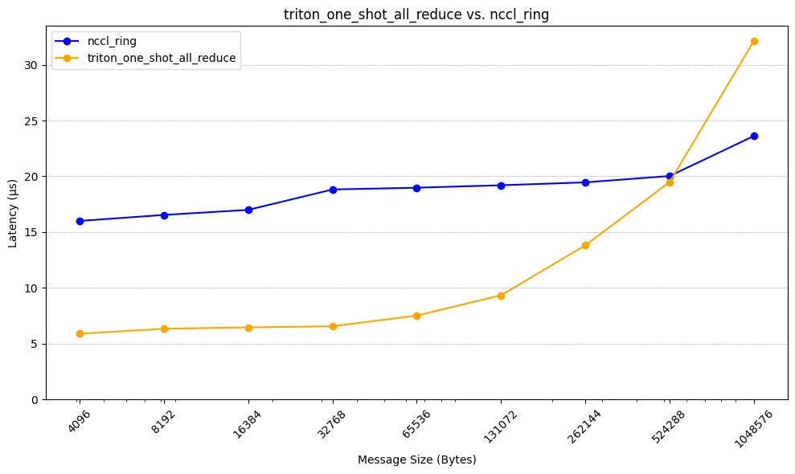
*Figure 14: trition_one_shot_all_reduce vs. nccl_ring*

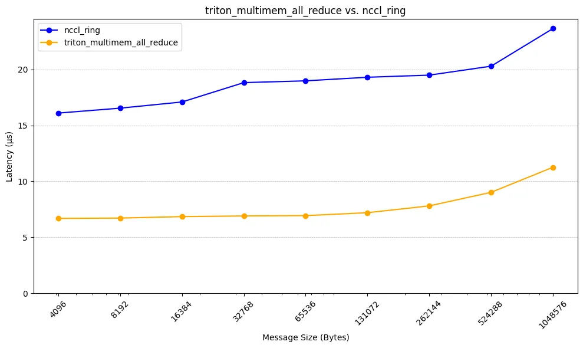
*Figure 15: trition_multimem_all_reduce vs. nccl_ring*

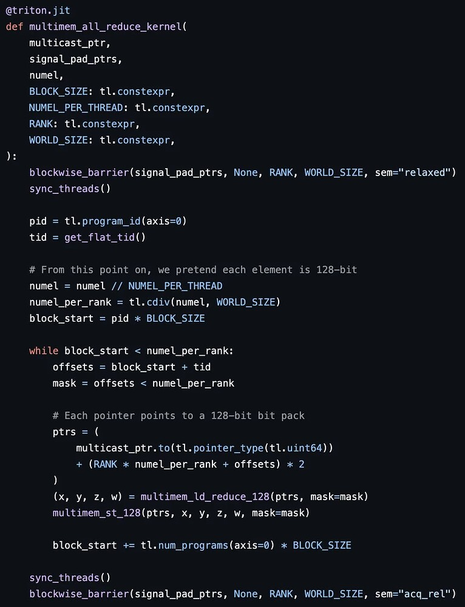
*Figure 16: The Trition NVLS all-reduce kernel. It can be easily understood and customized*

## 5.5 Low-Contention All-Gather/Reduce-Scatter (with Host APIs Only)
我们还尝试了基于复制引擎的、低竞争的全部收集（all-gather）和分散规约（reduce-scatter）实现。这些低竞争的实现方式会为环境矩阵乘法内核保留更多的流式多处理器（SM）资源，但代价是速度略慢。在某些情况下，综合效果会导致整体性能更好（注意：当可用NVSwitch V3+时，NVLS集合操作可能严格更优）。

For more details, see [low-contention collectives](https://github.com/pytorch/pytorch/blob/08be9ec/torch/distributed/_symmetric_memory/__init__.py#L1297)

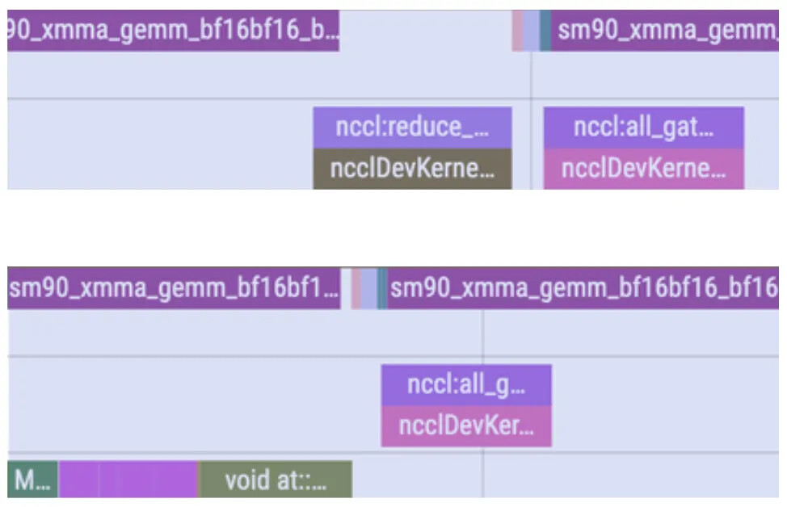
*Figure 17: TorchTitan Llama3 70B profiling trace (TP backward) comparison between NCCL all-gather and low-contention all-gather*


